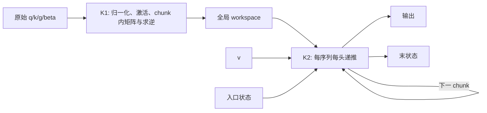

# C1 FlashKDA 理论分析：CHUNK、数值稳定性、SM100 与递推并行度

分析日期：2026-09-12。对象为题目指定的 FlashKDA `1ce47ea` 与 FLA KDA `a3edffc` 快照，默认每头 `Dk=Dv=128`、CHUNK=16、bf16 输入、gate lower_bound=-5。模型形状采用题面给定配置；每卡头数必须按 TP 切分。

**核心判断：现有证据支持保留 v1，并研究一个有条件启用的 SM100 后端。最值得先试的是 K2 的转置映射与 value 维并行拆分。直接把 CHUNK 改成 64，或者根据新一代 Tensor Core 峰值推断必然加速，都缺少理论依据。**

本文区分四种证据：源码直接确认的行为、精确算术下的推导、仓库已保存的历史测量、尚待 GPU 验证的假设。本次没有新运行 B300 benchmark、ncu 或模型评测。附带的 CPU 算术检查只用于核对公式与构造反例，不能替代任务要求的 GPU 实验。

题目要求的六个讨论点见 [TASK.md](/Users/simida/csdiy/wmhpc-training-camp-x-lcpu-ai-infra-seminars/assignment02/team/c1_flashkda/TASK.md:28)。以下先建立统一数学模型，再逐项回答。

**1．先明确 FlashKDA 究竟在计算什么。**

对单个序列、单个 head，令：

- $q_t,k_t\in\mathbb R^{D_k}$，$v_t\in\mathbb R^{D_v}$；$q,k$ 已做 L2 归一化。
- $g_t\in[-5,0]^{D_k}$ 为**激活后的自然对数衰减**；$D_t=\operatorname{diag}(\exp g_t)$。
- $\beta_t\in[0,1]$ 为激活后的写入强度。
- $S_t\in\mathbb R^{D_k\times D_v}$ 是数学状态。FlashKDA 接口实际按 value-first 存储 $S_t^T$。
- 默认输出 scale $s=1/\sqrt{D_k}$；下文把它吸收到 $q_t$ 中，涉及范数时再写出。

KDA 的三个步骤为：

$$
\bar S_t=D_tS_{t-1},\qquad
u_t=\beta_t(v_t-\bar S_t^Tk_t),\qquad
S_t=\bar S_t+k_tu_t^T,\quad o_t=S_t^Tq_t.
$$

它先遗忘旧状态，再用当前 key 查询旧状态，把预测误差写回，最后计算当前输出。因此输出包含当前 token 的更新；这里的因果 mask 必须包含对角线。

等价地：

$$
S_t=A_tS_{t-1}+B_t,\quad
A_t=(I-\beta_tk_tk_t^T)D_t,\quad
B_t=\beta_tk_tv_t^T.
$$

这同时解释了三个性质：时间方向有依赖；不同 head 独立；不同 value 列也独立。$D_t$ 是对角矩阵，但 $A_t$ 不是一般意义上的对角矩阵，key 方向上的 rank-1 修正把 key 维度耦合起来了。

标准注意力会在 token 之间构造二次规模的交互；这里固定每头状态为 $D_kD_v$，逐 token 运算为 $O(D_kD_v)$。CHUNK 算法的作用，是把大量小矩阵向量运算改写为适合 Tensor Core 的矩阵乘，交换一部分额外工作来提高吞吐。

上述等式直接对应 [naive.py 的逐 token 递推](/Users/simida/csdiy/wmhpc-training-camp-x-lcpu-ai-infra-seminars/assignment02/team/c1_flashkda/fla_kda_ref/naive.py:59)。KDA 的原始架构背景可以读 [Kimi Linear 技术报告](https://arxiv.org/html/2510.26692v1)。

接口层还有三个容易使对拍失效的区别。FlashKDA 接收 raw gate 和 beta logits，内部做激活；数学参考需要激活后的 $g,\beta$。自然对数 gate 的定义是 $g_{t,d}=\ell\,\sigma(e^{A_{log,h}}(g_{raw,t,d}+dt\_bias_{h,d}))$，其中 $\ell=-5$；源码乘 $\log_2e$ 后使用底数为 2 的指数，数学定义没有改变。FlashKDA 状态是 `[N,H,V,K]`，naive 默认是 `[N,H,K,V]`；两维都为 128 时，转置错误无法通过 shape 检查发现。FlashKDA 当前不支持参考实现中的所有 GVA/context-parallel 功能。相关约束见 [FLA backend verifier](/Users/simida/csdiy/wmhpc-training-camp-x-lcpu-ai-infra-seminars/assignment02/team/c1_flashkda/fla_kda_ref/backends/flash_kda.py:60)。

**2．从逐 token 递推，推导 K1/K2 的 chunk 表达。**

一个 chunk 内有 $C$ 个 token，编号 $1,\dots,C$，入口状态记为 $S_0$。定义逐通道前缀和：

$$
G_i=\sum_{t=1}^{i}g_t,\quad G_0=0.
$$

令矩阵每一行对应一个 token：

$$
K_d[i,:]=k_i^T\odot e^{G_i},\quad
K_i[i,:]=k_i^T\odot e^{-G_i},\quad
Q_d[i,:]=q_i^T\odot e^{G_i},
$$
$$
K_r[i,:]=k_i^T\odot e^{G_C-G_i},\quad
L=\operatorname{strictLower}\bigl(\operatorname{diag}(\beta)K_dK_i^T\bigr),\quad
M=\operatorname{lower}(Q_dK_i^T).
$$

这里 $K_i$ 的下标表示 inverse-decayed key，不是第 $i$ 个 token；源码称它 `k_inv`。为避免混淆，也可把这个矩阵记为 $K_{inv}$。

将前面的更新展开到 token $i$：

$$
\bar S_i=\operatorname{diag}(e^{G_i})S_0+
\sum_{j<i}\operatorname{diag}(e^{G_i-G_j})k_ju_j^T.
$$

代回误差修正公式，把 $u_i^T$ 按行堆成 $U\in\mathbb R^{C\times D_v}$，得到：

$$
(I+L)U=\operatorname{diag}(\beta)(V-K_dS_0),
$$
$$
U=(I+L)^{-1}\operatorname{diag}(\beta)(V-K_dS_0),
$$
$$
O=Q_dS_0+MU,
$$
$$
S_C=\operatorname{diag}(e^{G_C})S_0+K_r^TU.
$$

这四个式子就是理解整个实现的关键。K1 的 $K_d,Q_d,K_r,G_C,INV=(I+L)^{-1}$ 等准备工作不需要入口状态，可以沿 token/chunk 并行；K2 得到入口状态后，完成五类矩阵乘并更新状态，再进入下一个 chunk。

源码 [K1 的准备与输出](/Users/simida/csdiy/wmhpc-training-camp-x-lcpu-ai-infra-seminars/assignment02/team/c1_flashkda/FlashKDA/csrc/smxx/fwd_kernel1.cuh:343) 与 [K2 的融合计算](/Users/simida/csdiy/wmhpc-training-camp-x-lcpu-ai-infra-seminars/assignment02/team/c1_flashkda/FlashKDA/csrc/smxx/fwd_kernel2.cuh:460) 实现的正是这个分解。不要把源码中的 `INV` 误读成包含 beta 的整体变换；beta 在右端另行相乘。

本次用 16 token、4 维随机样例在 CPU double 算术下检查了逐 token 与 chunk 等价性：输出最大绝对差 $2.22\times10^{-16}$，末状态 $2.78\times10^{-16}$，求逆残差 $8.33\times10^{-17}$。这验证公式整理的一致性，不验证 GPU 的浮点行为。

**3．讨论点一：CHUNK=16 的数值范围理由，是有硬边界的。**

bf16 的最大有限值约 $3.3895\times10^{38}$，最小正规数为 $2^{-126}\approx1.1755\times10^{-38}$。相对舍入单位约 $u_b=2^{-8}=0.00390625$；动态范围与有效位数是不同问题。

在 $g\in[-5,0]$ 的最坏情况下，chunk 中独立存储的两个指数因子分别达到 $e^{-5C}$ 与 $e^{5C}$：

| CHUNK | 最小 $e^{G}$ | 最大 $e^{-G}$ | 当前指数分解能否覆盖最坏输入 |
|---:|---:|---:|---|
| 16 | $1.8049\times10^{-35}$ | $5.5406\times10^{34}$ | 两者都在正常范围内 |
| 32 | $3.2575\times10^{-70}$ | $3.0698\times10^{69}$ | 下溢与上溢 |
| 64 | $1.0611\times10^{-139}$ | $9.4240\times10^{138}$ | 更严重的下溢与上溢 |

实际边界还受 `ex2.approx.ftz.f32` 影响。它先以 fp32 求指数并 flush subnormal，之后才转 bf16。因此令 $a=-G$，保守的正常范围要求是：

$$
a<126\ln2\approx87.3365,\qquad a<\ln(\mathrm{bf16}_{max})\approx88.7189.
$$

代入 $a\le5C$，得到 $C<17.4673$。所以 16 是满足最坏情况边界的自然 tile 大小；17 在这一纸面范围条件下也可，16 并不是数学上唯一可行的数字。这里保证的是独立指数因子的范围；之后乘任意小的 q/k 分量，仍可能产生下溢。

一般地，lower_bound 为 $-\lambda$ 时，应检查 $C\lambda<87.3365$，并留出近似指数与缩放的裕量。C32/C64 不是对所有输入都会溢出：若累计 gate 足够弱，它们也可保持有限值。但它们不能保留当前完整输入域的范围保证。

**仅把这些中间量改存 fp32，无法修复这个问题。** fp32 和 bf16 具有相同数量的指数位；增加 mantissa 有助于精度，却不能表示 $e^{160}$。具体指数调用和转换可见 [K1 的 decay_apply](/Users/simida/csdiy/wmhpc-training-camp-x-lcpu-ai-infra-seminars/assignment02/team/c1_flashkda/FlashKDA/csrc/smxx/fwd_kernel1.cuh:452)。

更深一层看，真实因果项 $e^{G_i-G_j}$ 在 $i\ge j$ 时逐通道不超过 1；它本身并不爆炸。问题来自将它写成一个极小因子与一个极大因子的乘积。这属于计算表示的范围问题，不是 KDA 递推必然数值发散。

大 chunk 的 rescale 因此必须保持整个代数系统一致。若选参考向量 $R$，把指数改为 $G_i-R$，状态坐标、入口状态乘法、末状态恢复都要同步变换。一个居中的锚点可将 C32 的最坏跨度分配为约 $\pm80$，但 C64 仍约 $\pm160$，而且状态坐标自身的范围仍要重新分析。不能只给 `cumsum` 减一个中心值，其余公式照旧。

更稳妥的思路是分小块，在跨块因果交互中选择位于两块之间的锚点 $G_a$，写成 $e^{G_i-G_a}e^{G_a-G_j}$，让两个因子都不大于 1；块内维持受控跨度。FLA 已有类似的块间处理，可沿 [chunk_intra.py](/Users/simida/csdiy/wmhpc-training-camp-x-lcpu-ai-infra-seminars/assignment02/team/c1_flashkda/fla_kda_ref/chunk_intra.py:155) 阅读。重标定增加指数、缩放、描述符/布局管理及融合难度，必须计入性能比较。

**4．讨论点一的第二部分：Neumann 求逆的代价和稳定性必须分开讨论。**

$L$ 是 $C\times C$ 严格下三角矩阵，故 $L^C=0$。于是：

$$
(I+L)^{-1}=I-L+L^2-\cdots+(-L)^{C-1}.
$$

这是有限精确恒等式，**不需要 $\|L\|<1$ 的无限级数收敛条件**。但 nilpotent 并不能保证有限精度计算稳定。

当 $C=16$，使用二倍展开：

$$
(I+L)^{-1}=(I-L)(I+L^2)(I+L^4)(I+L^8).
$$

先有 $I-L$，之后每一级用一次平方得到 $L^{2^r}$，再用一次乘加扩展逆矩阵。总共六次 $16^3$ 矩阵乘。该部分采用 **fp16 输入与 fp16 accumulator**，最终转为 bf16 供 K2 使用，见 [MMA atom 定义](/Users/simida/csdiy/wmhpc-training-camp-x-lcpu-ai-infra-seminars/assignment02/team/c1_flashkda/FlashKDA/csrc/smxx/utils.cuh:199) 和 [torch_ref 的对应流程](/Users/simida/csdiy/wmhpc-training-camp-x-lcpu-ai-infra-seminars/assignment02/team/c1_flashkda/FlashKDA/tests/torch_ref.py:221)。

按一次 FMA=2 FLOP、沿用密集矩阵乘估计：

$$
F_{inv}(C)=4(\log_2C-1)C^3.
$$

| CHUNK | 求逆 GEMM 数 | 每 chunk FLOP | 每 token FLOP | 每 token 相对 C16 |
|---:|---:|---:|---:|---:|
| 16 | 6 | 49,152 | 3,072 | 1 |
| 32 | 8 | 524,288 | 16,384 | 5.33 |
| 64 | 10 | 5,242,880 | 81,920 | 26.67 |

这是“原样扩大当前求逆方法”的代价，不是所有分块三角求解算法的下界。采用分块前代、递归分解或结构化变换，可以改变运算组织和数值行为；FLA C64 也不能被当成简单放大版 C16。

官方设计文档提出逆矩阵元素在 $[-1,1]$ 内，因此 fp16 的范围足够。这个结论需要补齐两层条件。首先在归一化 key、$0\le\beta\le1$、衰减非扩张的假设下，它确实有结构依据。沿用 $A_t=(I-\beta_tk_tk_t^T)D_t$，有：

$$
INV_{ii}=1,\qquad INV_{ij}=-\beta_i k_i^TD_iA_{i-1}\cdots A_{j+1}k_j\quad(i>j).
$$

各衰减/转移因子的二范数不超过 1，key 范数与 beta 也不超过 1，所以 $|INV_{ij}|\le1$。其次，**最终结果有界，不能推出所用算法的中间结果有界。**

一个明确反例是所有 $k_i$ 相同且为单位向量、$\beta_i=1$、$g_i=0$ 的极限情形。此时 $L$ 是全 1 的严格下三角矩阵，且：

$$
(L^p)_{ij}=\binom{i-j-1}{p-1}\quad(i-j\ge p).
$$

结果为：

| CHUNK | 求逆路径中的高次幂 | 最大元素 |
|---:|---:|---:|
| 16 | $L^8$ | $\binom{14}{7}=3432$ |
| 32 | $L^{16}$ | $\binom{30}{15}=155,117,520$ |
| 64 | $L^{32}$ | $\binom{62}{31}=465,428,353,255,261,088$ |

fp16 最大有限值只有 65504，而最终 $(I+L)^{-1}$ 在这个例子中只有主对角 1 和首下对角 -1。所以 C32/C64 即使没有指数范围问题，也可以先在 fp16 Neumann 的中间量上出问题。事实上无需等到表中最后一个幂：第二轮 doubling 的部分和 $P_8=I-L+\cdots-L^7$，左下角绝对值为 $\binom{C-3}{6}$，C32/C64 分别达到 475,020 和 55,525,372，已超出 half 范围。有限 gate/beta logits 可以逼近这个极限，浮点激活也可能舍入到端点。

C16 的 3432 虽未溢出，但大中间量仍可能经历强消去。比如上述极限例子中某一角元素要把约 -1716 与 +1716 消去为 0。此数量级的 half ULP 约为 1；若输入、求和或先前幂略有误差，不能由最终值的范围推断误差很小。这个论证指出风险，不宣称当前 GPU 已测得某个错误值。

因此“C32/64 哪个理由先破”没有对所有输入都相同的排序：强衰减端首先暴露指数表示范围；弱衰减且高度相关 key 端可暴露求逆中间量和消去；即使两者均温和，也还要支付增长的求逆成本。CHUNK=16 的三个理由是互相配合的设计条件。

**5．讨论点二：tcgen05 与 CHUNK=16，到底在哪里不匹配？**

先限定比较对象为普通 dense、非 `.ws`、bf16/fp16 的 `tcgen05.mma`。单 CTA 模式支持 $M\in\{64,128\}$、$N\in\{8,16,\dots,256\}$；双 CTA 支持 $M\in\{128,256\}$、$N\in\{16,32,\dots,256\}$；单指令 K 为 16。下面表格的逻辑 K128 由八个 K16 步累加得到。bf16 对应 fp32 accumulator；fp16 可选 fp16/fp32 accumulator。合法 PTX 形状与 CUTLASS 某个高层 kernel 是否提供对应模板也应分开。依据 [NVIDIA PTX 的 tcgen05 形状表](https://docs.nvidia.com/cuda/parallel-thread-execution/index.html#tcgen05-matrix-shape)。

定义形状利用率为 $\eta=MNK/(M'N'K')$，只衡量有效乘积相对 padded 乘积的比例，不等同于硬件峰值利用率。

| 阶段 | 原始逻辑 GEMM $(M,N,K)$ | 保持原方向 | 采用转置恒等式后 |
|---|---|---|---|
| K1 的 $K_dK_i^T,Q_dK_i^T$ | $(16,16,128)$ | pad 到 $(64,16,128)$，25% | 仍是 16×16 输出，无单独转置收益 |
| K1 的一次 Neumann GEMM | $(16,16,16)$ | pad 到 $(64,16,16)$，25% | 仍受 16×16 输出限制 |
| K2 的 $K_dS,Q_dS$ | $(16,128,128)$ | pad M，25% | $(128,16,128)$，100% |
| K2 的 $INV\cdot\text{residual},MU$ | $(16,128,16)$ | pad M，25% | $(128,16,16)$，100% |
| K2 的 $K_r^TU$ | $(128,128,16)$ | 100% | 100% |

其中使用的是 $(AB)^T=B^TA^T$。例如令 $R=S^T$，K2 可以表达为：

$$
P^T=RK_d^T,\quad
U^T=(V^T-P^T)\operatorname{diag}(\beta)INV^T,
$$
$$
O^T=RQ_d^T+U^TM^T,\quad
R_{next}=R\operatorname{diag}(e^{G_C})+U^TK_r.
$$

这套表达使 K2 的五类矩阵乘在数学形状上全部适合单 CTA 的普通 tcgen05。故“CHUNK=16，所以换 SM100 最多只能用到 25%”是错误的总体判断。

进一步，K1 构造 $L$ 与 $M$ 共享右操作数，理论上可纵向拼接 $K_d,Q_d$ 为 32 行后共同计算，pad 到 64 行时达到 50% 面积利用率；但逆矩阵仍为 16×16，且拼接后的精度转换和不同 mask 需要处理。不要把 K1 每个阶段的孤立 padding 比例当成完整优化后的下界。

还有两个限定：普通 M64 路径在 PTX 中有半 datapath 利用的说明，合法形状不意味着满峰值；`.mma.ws` 有 M32 变体，但其 N 从 64 起，不能使一个 16×16 求逆自然匹配。因此所有“最小 tile”说法都要写清指令变体。

真正困难的是数据流。当前 `mma.sync` 的累加器在寄存器中，中间 U 利用 `MOVM_T` 在寄存器内转置，直接供后续矩阵乘；状态更新可直接融合 fp32 运算与 bf16 写回。tcgen05 的累加器位于 TMEM，异步完成、TMEM load、标量处理、操作数再组织及 shared/TMEM 可见性都需要重构。具体限制应对照 [CUTLASS 的 Blackwell 功能说明](https://docs.nvidia.com/cutlass/latest/media/docs/cpp/blackwell_functionality.html)；当前寄存器融合见 [K2 Phase 3/4](/Users/simida/csdiy/wmhpc-training-camp-x-lcpu-ai-infra-seminars/assignment02/team/c1_flashkda/FlashKDA/csrc/smxx/fwd_kernel2.cuh:588)。

不要假设“转置之后所有中间量能在 TMEM 零拷贝传递”。虽然代数上有好形状，右操作数的存放方式、布局、beta 逐列处理、state 衰减与舍入仍需具体设计；最终 PTX/SASS 和时序才是证据。

可以用如下比较式组织 microbench。这是用于归因的示意拆分，实际时间要按流水线重叠后的暴露成本与关键路径计算，不能将孤立测得的每项延迟直接相加：

$$
t_{80}=t_{mma80}+t_{ldmatrix}+t_{register\ conversion}+t_{sync80},
$$
$$
t_{100}=t_{mma100}+t_{TMEM\ traffic}+t_{operand\ staging}+t_{epilogue}+t_{sync100}.
$$

必须比较 $t_{100}<t_{80}$，而不是只比较第一项。在最小依赖链中，新指令的吞吐优势可能被增加的往返和等待抵消；在能连续发射多项独立工作时，它也可能获益。

测量应包含三个层次：相同起止数据位置和可见性条件的单 GEMM，例如从已就绪的 SMEM 输入开始，计到结果能被 SIMT 正确消费，并另报裸指令基准；带真实中间转换的单 chunk 链；保持 workspace 与状态 I/O 条件一致的完整 K2/完整 fwd。只测预热大矩阵的 tcgen05 吞吐，不能回答 C1。

还可量化两种不同的“只换指令”。如果全部保持原方向并 padding，K1 的 MMA 工作扩大四倍，K2 除状态更新外也扩大四倍，总发出工作约为 5,963,776 FLOP/chunk，是原来的 3.165 倍。若 K2 全部转置消除 padding、K1 仍直接填零迁移，总量约 2,424,832 FLOP，是原来的 1.287 倍。若 K1 保留旧路径、只改 K2，则没有这项形状额外工作。这些是指定映射的运算量比较，不能直接解释为运行时间比。

**6．讨论点三：时间依赖存在，但并行度不只来自 head。**

设真实独立序列数为 $N$，每卡头数为 $H_{local}=96/TP$。当前 K1 的逻辑工作数约为 $H_{local}\sum_n\lceil T_n/C\rceil$，K2 则只有 $NH_{local}$ 个 CTA；每个 K2 CTA 遍历一个序列一个头的所有 chunk。启动代码见 [fwd_launch.cu](/Users/simida/csdiy/wmhpc-training-camp-x-lcpu-ai-infra-seminars/assignment02/team/c1_flashkda/FlashKDA/csrc/smxx/fwd_launch.cu:169)。

仓库的 B300 probe 记录了 148 个 SM。以 T 总量 8192、C16 为例：

| 输入组织 | K1 逻辑 chunk-head 数 | K2 CTA 数 | 单条链长度 |
|---|---:|---:|---:|
| 1×8192，96 头 | 49,152 | 96 | 512 chunk |
| 8×1024，96 头 | 49,152 | 768 | 64 chunk |
| 1×8192，12 头（TP8） | 6,144 | 12 | 512 chunk |
| 8×1024，12 头（TP8） | 6,144 | 96 | 64 chunk |

即使每个 CTA 都运行得很好，12 个 CTA 也最多同时占据 12 个 SM，覆盖率约 $12/148=8.11\%$。长 T 增加每条链的工作，不能增加链数。96 个 CTA 的覆盖率上限约 64.86%；这与单个活跃 SM 内的 warp occupancy 是不同指标。

独立序列确实能增加并行度，但不能把一个长序列随意分成八条零状态短序列来获得这个加速，那会改变语义。若强行切长序列，就必须正确计算各段入口状态。

候选方案的收益与反例可列成下面的对照：

| 方案 | 真正改变了什么 | 适用条件与主要反例 |
|---|---|---|
| 增加真实独立序列 batch | 增加状态链数并缩短每条链 | 吞吐服务有积累 batch 的机会；低延迟单请求不能任意等待或伪造序列 |
| 按 value 维拆 state | 每个 head 产生多条无归约子链 | 小 NH 很有吸引力；复制只读输入、tile 变瘦，NH 已大时可能倒退 |
| 一个 CTA 处理多个 head | 合并调度，可能共摊部分开销 | 会减少 CTA 数，不能增加低 NH 下的 SM 覆盖率；交错独立链可能改善 CTA 内等待，简单拼接则会产生交叉项 |
| CTA 驻留/任务队列 | 改善调度和变长负载平衡 | 当前 K2 已驻留遍历整条链；NH<SM 时队列本身无法创造工作 |
| 两个 CTA 合作一个 head | 为同一链增加硬件资源，改变布局 | 需要 cluster 协作与同步；总链数不变，短 K、小 N 时未必抵消额外代价 |
| 时间块的 affine scan | 用额外变换计算换取时间并行 | 数学可行，但变换复合变稠密/增秩，额外 FLOP、存储和数值次序不能忽略 |

value 切分值得单独强调。若按列把 $S=[S^{(1)}\ S^{(2)}]$、$V=[V^{(1)}\ V^{(2)}]$ 分块，那么：

$$
U^{(r)}=INV\operatorname{diag}(\beta)(V^{(r)}-K_dS^{(r)}),
$$
$$
O^{(r)}=Q_dS^{(r)}+MU^{(r)},\quad
S_{next}^{(r)}=\operatorname{diag}(e^{G_C})S^{(r)}+K_r^TU^{(r)}.
$$

所有分块互不依赖，不需要求和归约。反之，沿 key 维切分会把 $K_dS$ 的求和拆散，产生归约与同步，不能套用同样的论证。当前 K2 四个计算 warp 已分别负责 value 子块，只是都在同一个 CTA/SM 上；把这一级分工提升到 CTA 层面有明确的代数依据。

若拆为 $r$ 份，总 CTA 从 $NH$ 变为 $rNH$，状态存储按份减少，但 $K_d,Q_d,K_r,INV,M,g_{total}$ 会被多个 CTA 复用/重读。逻辑上每多一份有约一个 workspace tile 的额外只读请求，是否落到 HBM 取决于 L2 命中。r=2 时单份 value=64，转置乘法 M64 合法，但仍有前述 datapath 利用问题；r=4 时 M32 要再次考虑 padding。不能只按 CTA 数给出线性加速预测。

多 head 拼接也不是免费的填满 tile 方法。四个独立 head 的矩阵对若朴素堆叠，会得到跨 head 的交叉乘积；构造一个 64×64 输出后只有四个 16×16 对角块有用，仍然只有 25% 面积是目标结果。只有共享操作数或特定批处理机制时，才有不同的成本结构。

时间并行在理论上没有被绝对禁止。chunk 变换为 $S_{j+1}=A_jS_j+B_j$，复合操作：

$$
(A_2,B_2)\circ(A_1,B_1)=(A_2A_1,A_2B_1+B_2)
$$

具有结合性。问题在于一般稠密 $A$ 的复合涉及 $O(D_k^3)$ 运算，chunk 内低秩表示的秩在复合后也可能增长。scan 降低依赖深度，却不自动降低总工作；对 D128、C16 必须把新变换与保存中间状态的成本列全。

**7．讨论点四：FLOP、流量与状态往返的纸面模型。**

令 $D_k=D_v=D$，忽略边界 padding，先统计主矩阵乘，FMA 按 2 FLOP：

$$
F_{K1}=4C^2D+4(\log_2C-1)C^3,
$$
$$
F_{K2}=6CD^2+4C^2D,
$$
$$
F_{total}=6CD^2+8C^2D+4(\log_2C-1)C^3.
$$

K2 的三项 $2CD^2$ 分别是 $K_dS,Q_dS,K_r^TU$，两项 $2C^2D$ 是 $INV$ 与 $M$ 的乘法。没有把归一化、gate、指数、逐元素状态 FMA、转换、地址计算算进去；三角 mask 也没有让硬件密集 MMA 的上三角工作凭空消失。

| CHUNK | K1 FLOP/chunk | K2 FLOP/chunk | 总 FLOP/token/head | 相对 C16 |
|---:|---:|---:|---:|---:|
| 16 | 180,224 | 1,703,936 | 117,760 | 1.000 |
| 32 | 1,048,576 | 3,670,016 | 147,456 | 1.252 |
| 64 | 7,340,032 | 8,388,608 | 245,760 | 2.087 |

C32/C64 是沿用同一 dense Neumann 分解的纸面外推，不是现有可运行版本的测量，也尚未包含 rescale 和重构的新增成本。C16 时 K2 约占主矩阵乘 FLOP 的 90.43%，但这**不是** K2 耗时占比。K1 含门控/SFU/归约，K2 有低并行度/依赖链，两者的 FLOP/s 不同。

大 C 并未减少每 token 的 $6D^2$ 主项。它的潜在收益来自减少 chunk 边界同步、减少状态读写频率、改变 tile/dataflow；代价是 $C^2D$ 与求逆工作的增长。把“chunk 数变为四分之一”直接当成“计算减少四倍”是错误的。

K1→K2 每 head 每 chunk 的 workspace 包含三个 bf16 C×D 张量、一个 fp32 D 向量、两个 bf16 C×C 矩阵：

$$
W(C,D)=6CD+4D+4C^2\text{ bytes}.
$$

| CHUNK | workspace/chunk/head | workspace/token/head |
|---:|---:|---:|
| 16 | 13,824 B | 864 B |
| 32 | 29,184 B | 912 B |
| 64 | 66,048 B | 1,032 B |

因此沿用这个分解时，大 C 连 workspace 的每 token 逻辑字节数也不一定减少。C16、T8192、H96 的有效 workspace 约 648 MiB；实际 API 为尾块/序列元数据保守多分配一些。公式直接来自 [get_workspace_size](/Users/simida/csdiy/wmhpc-training-camp-x-lcpu-ai-infra-seminars/assignment02/team/c1_flashkda/FlashKDA/csrc/flash_kda.cpp:20)。

用原始 q/k/g/v 读取、输出写入、beta 两次读取及 workspace 一写一读构造一阶逻辑流量：

$$
B_{logical}=10CD+4C+2W=22CD+4C+8D+8C^2.
$$

C16,D128 时是 48,192 B/chunk，对应约 39.10 FLOP/B。它不包含所有参数读取、对齐 overfetch、beta 转置、初末状态、spill，也不等于 DRAM 实际传输。

按当前 TMA 请求进一步计入 32 个 beta 槽与 K1 的 dt_bias：K1 读取 12,864 B、写入 13,824 B；K2 读取 17,984 B、输出 4,096 B，总计约 48,768 B/chunk。A_log 小量访问和其他辅助 kernel 仍需另计。若有 bf16 初末状态，每序列每 head 再加 $4D^2=65,536$ B。这个模型的 C16 强度约为 38.6 FLOP/B，计入固定场景初末状态后约 38.53。

**状态留在片上，不应每个 chunk 都计入 HBM。** 当前 K2 中，同一次 state 读取为 $K_dS$ 和 $Q_dS$ 复用；之后状态更新再读旧状态并写回。因此状态本身至少产生每 chunk 两读一写，即 $6D^2=98,304$ B 的 shared-memory 读写，C16 时是每 token 6,144 B。实际还包括其他 shared 访问。这正是大 chunk 可能减少的成本之一。

共享内存占用也不是“状态只有 32 KiB”。K2 含一个无条件声明的 union，其中 fp32 state 转换 buffer 为 64 KiB；再加 bf16 state 的 32 KiB，整体至少约 96 KiB 加 barrier/alignment。即使外部状态采用 bf16，该模板里的 union 仍参与 `sizeof`。布局见 [SharedStorageK2](/Users/simida/csdiy/wmhpc-training-camp-x-lcpu-ai-infra-seminars/assignment02/team/c1_flashkda/FlashKDA/csrc/smxx/fwd_kernel2.cuh:82)。

对于该 B300，228 KiB/SM 的共享内存约束意味着最多容纳两份这种 K2 CTA；寄存器等限制还可能进一步降低。应以实际 `sizeof`、ptxas 与 occupancy 数据为准。K1 的 `__launch_bounds__(256,8)` 是编译目标，不是“已实现 8 CTA/SM”的证明。CC10.3 的资源限制可查 [CUDA Compute Capabilities 表](https://docs.nvidia.com/cuda/cuda-programming-guide/05-appendices/compute-capabilities.html)。

若机械扩展当前三级输入、两级输出的存储方案，并保留 128 B 对齐，则每级输入大小可估为 $I(C)=8CD+128+4D+4C^2$，总共享内存约为：

$$
S_{shared}(C)\approx2D^2+\max\{3I(C)+4CD,\ 4D^2\}+\text{barriers}.
$$

| CHUNK | 每 CTA 容量预算，不含 barrier | 对 B300 的直接影响 |
|---:|---:|---|
| 16 | 至少 96 KiB | 共享内存最多允许 2 CTA/SM |
| 32 | 约 157.875 KiB | 最多允许 1 CTA/SM |
| 64 | 约 305.875 KiB | 超过 227 KiB/CTA 上限 |

这不是对当前固定 C16 源码直接改常量的可运行性保证，而是扩展其 buffer 结构的容量预算。C64 要减少 stage、改变布局或驻留方式才能容纳；这些调整又可能改变重叠能力与吞吐。除了指数、求逆和 tile，片上容量也是大 chunk 路线的约束。

**8．compute-bound / memory-bound 不能只靠一个 arithmetic intensity 标签回答。**

标准 roofline 为：

$$
P\le\min(P_{peak},AI\cdot BW_{HBM}).
$$

官方 HGX B300 八卡 BF16 sparse 峰值为 36 PFLOP/s，并注明 dense 为一半；折合单卡 dense 2.25 PFLOP/s，结合 8 TB/s 的标称带宽，名义机器平衡点约为 $2250/8=281.25$ FLOP/B。当前约 38.6 FLOP/B 的请求模型低于这个平衡点，在充分并行、请求均落到 HBM 等理想条件下会偏向内存侧限制。峰值口径见 [NVIDIA HGX 规格](https://www.nvidia.com/en-au/data-center/hgx/)，带宽见 [HGX AI Factory 组件规格](https://docs.nvidia.com/enterprise-reference-architectures/hgx-ai-factory/latest/components.html)。

但本题至少需要四类上界：HBM、L2/shared、Tensor Core 指令与数据转换、串行状态链/同步。对于低 NH 的 K2，还要考虑实际活跃 SM 比例。全卡平均算力低、全卡平均 HBM 带宽也低，可以同时出现；这往往提示工作暴露不足或依赖延迟，不能硬归入“DRAM 已饱和”。这个设备 dense 峰值也不是当前 legacy MMA 小矩阵负载已验证可达到的峰值。

更加贴近本题的粗模型是：

$$
t_{K2}\gtrsim\max\left(
B_{HBM}/BW_{effective},\ F/P_{effective},\
(T_{max}/C)\,t_{dependent\ chunk}
\right),
$$

其中 $P_{effective}$ 受活跃 SM 数、tile 利用率、发射效率、operand staging 和资源占用共同影响。公式中的各项也并非完全独立，最终仍需 profile。

建议对 K1、K2、beta 转置等分别采集下列证据，不把整条 fwd 的一个均值拆作单 kernel 结论：

| 问题 | ncu section / metric 方向 | 如何解释 |
|---|---|---|
| 哪个阶段占主要时间 | LaunchStats、kernel duration，例如 `gpu__time_duration.sum` | 先得到 K1/K2 实际时间份额 |
| DRAM 是否接近可达到的带宽 | MemoryWorkloadAnalysis、`dram__bytes_read.sum`、`dram__bytes_write.sum`、`dram__throughput.avg.pct_of_peak_sustained_elapsed` | 必须同时看字节量和占峰值比例 |
| L2 是否改变纸面流量 | L2 bytes、hit rate、`lts__throughput...` | workspace 逻辑读写不一定全部穿透 HBM |
| Tensor Core 是否繁忙 | ComputeWorkloadAnalysis、对应架构 tensor pipe active/cycle 指标 | 指标命名可能随架构/ncu 版本变化，应先 query |
| 可调度工作是否不足 | grid size、waves/SM、active warps、eligible warps、issue active | 低 NH 的全卡空闲与活跃 SM 内低 occupancy 要分开 |
| 卡在 shared/依赖还是全局访存 | shared wavefront/bank conflict；short/long scoreboard、barrier、wait 等 stall 指标 | 单个 stall 名称只能作线索，需要映射到 SASS/源码 |
| 是否被寄存器/共享内存限制 | Occupancy、registers/thread、shared memory/CTA、local load/store | launch_bounds 与 spill 的取舍必须通过真实资源值验证 |

metric 名称应以目标卡上 `ncu --query-metrics` 的结果为准；不要因为某个名字在别的代际存在就假设 B300 一定提供。采集和解释方法见 [Nsight Compute Profiling Guide](https://docs.nvidia.com/nsight-compute/ProfilingGuide/index.html)。

SASS 取证也要精确：源码中的 `SM80_*` 名称是静态证据；对实际已编译 kernel 反汇编，确认热点对应传统 MMA/HMMA 路径，且没有改用 tcgen05 对应路径，才是当前设备二进制的证据。不能只在文件中搜不到 `tcgen05` 就声称已经完成 SASS 验证。

**9．仓库已保存的 B300 数据，能支持什么结论？**

已有环境记录显示 `NVIDIA B300 SXM6 AC, CC=10.3, SMs=148`，见 [环境 probe](/Users/simida/csdiy/wmhpc-training-camp-x-lcpu-ai-infra-seminars/assignment02/team/c1_flashkda/results/environment-20260910T041816895557Z.json:29)。已有计时采用固定种子、30 warmup、5×200 次 CUDA-event 样本，并经过有限值检查。

| H | 独立序列长度 | mean ms | 相对同 H 单序列的加速 |
|---:|---|---:|---:|
| 96 | [8192] | 1.074566 | 1.00× |
| 96 | [1024]×8 | 0.709154 | 1.52× |
| 12 | [8192] | 0.835067 | 1.00× |
| 12 | [1024]×8 | 0.160879 | 5.19× |

数据来源是 [历史计时 JSON](/Users/simida/csdiy/wmhpc-training-camp-x-lcpu-ai-infra-seminars/assignment02/team/c1_flashkda/results/flashkda-bench-20260910T043648237433Z.json)，方法与明确限制见 [bench_flashkda.py](/Users/simida/csdiy/wmhpc-training-camp-x-lcpu-ai-infra-seminars/assignment02/team/c1_flashkda/bench_flashkda.py:1)。

H 从 96 降到 12，固定长序列的理论工作量约减少八倍，时间却只降约 22.3%；同样 H12、同样 token 总量，八条真实独立序列比一条长序列快 5.19 倍。这是并行度/临界路径敏感的强证据，与 K2 grid 的理论预测一致，但仍未单独识别 K1/K2 时间，也没有排除缓存、调度、变长路径等影响。

按前节请求字节模型，H96 单长序列约 2.403 GB、92.61 GFLOP，除以其完整 fwd 时间得到约 2.24 TB/s 和 86.2 TFLOP/s；H12 则约 0.300 GB、11.58 GFLOP，对应约 0.360 TB/s 与 13.9 TFLOP/s。它们是**基于模型的等效速率**，不是 ncu 测得的 HBM 带宽或硬件计数器 FLOP/s。B300 平台标称 HBM 带宽为 8 TB/s，可参考 [NVIDIA HGX 组件规格](https://docs.nvidia.com/enterprise-reference-architectures/hgx-ai-factory/latest/components.html)；实机可持续值还需测量。

这些历史数据没有完成：FLA 同环境性能对照、完整精度测试、SM100 挑战路线、成功的 ncu/SASS 取证。环境记录中对一个普通 probe kernel 的 ncu 也返回 `Failed to prepare kernel for profiling`，错误码 9；所以目前没有可用的本机 ncu 证据支持“确定 compute-bound”或“确定 memory-bound”。

官方 GB200 表中，H96 固定/八序列分别为 1.0087/0.7064 ms，H64 则 0.9247/0.4811 ms；它也表现出对序列组织的敏感性。但这是不同硬件/环境的官方结果，不能作为本机 B300 加速比。原表见 [BENCHMARK_GB200.md](/Users/simida/csdiy/wmhpc-training-camp-x-lcpu-ai-infra-seminars/assignment02/team/c1_flashkda/FlashKDA/BENCHMARK_GB200.md:11)。

完整接口还有 workspace 分配、beta 转置及可能的变长辅助操作；分析一个 kernel 的改进时必须同时报告 kernel-only 与 public API 延迟，避免把二者混用。

**10．讨论点五：bf16 状态的误差传播，先从稳定性讲清楚。**

在精确归一化 $\|k_t\|_2\le1$、$\beta_t\in[0,1]$ 下，$I-\beta_tk_tk_t^T$ 的特征值在 $[0,1]$；$D_t$ 的范数也不超过 1。因此：

$$
\|A_t\|_2\le\|D_t\|_2=e^{\max_d g_{t,d}}\le1.
$$

也就是说，对固定输入而言，精确递推不会把旧状态扰动在二范数下无限放大。这里不能省略条件：量化后 key 的范数可能略偏离 1，允许的 beta 范围若改变也要重做界限；更一般的非扩张条件是 $0\le\beta\|k\|^2\le2$。

设每 chunk 的 bf16 保存误差与其他局部算术误差合为 $R_j$，则：

$$
E_{j+1}=A_{chunk,j}E_j+R_j.
$$

若 $\|A_{chunk,j}\|\le\rho<1$ 且 $\|R_j\|\le\epsilon$，有：

$$
\|E_m\|\le\rho^m\|E_0\|+\epsilon\frac{1-\rho^m}{1-\rho}.
$$

但 safe gate 的约束 $g\in[-5,0]$ 给的是强衰减端下界，并没有保证所有通道远离 0。因此无法为所有合法输入取一个统一的严格 $\rho<1$。接近无衰减时只能用 $\|E_m\|\le\|E_0\|+m\epsilon$ 这类宽松界；“状态非扩张”与“误差可忽略”不是同一命题。

归一化 query 给出 $\|\Delta o_t\|_2\le s\|\Delta S_t\|_F$ 的绝对误差界，但相对误差依赖真实输出幅度，真实输出接近 0 时可以很大。还应单独考虑 q/k、gate、beta、inverse、U 与 output 的量化，不能把全 kernel 与 fp64 的全部差异都归因于状态存储。

当前源码在每个 chunk 更新后做 bf16 写回，即使乘加采用 fp32，也会再次量化。代码见 [K2 的状态更新](/Users/simida/csdiy/wmhpc-training-camp-x-lcpu-ai-infra-seminars/assignment02/team/c1_flashkda/FlashKDA/csrc/smxx/fwd_kernel2.cuh:718)。而传入/传出 `float32` state 只改变接口 I/O：初始状态仍会转为 bf16，最终状态可能只是 bf16 数值转换回 fp32。见 [初始状态转换](/Users/simida/csdiy/wmhpc-training-camp-x-lcpu-ai-infra-seminars/assignment02/team/c1_flashkda/FlashKDA/csrc/smxx/fwd_kernel2.cuh:267)。因此“把 final_state dtype 改成 fp32 后误差没变”无法评价真正的 fp32 状态方案。

**11．一个 bf16 状态会停止衰减的理论反例。**

选归一化 key 恒为 $e_1$，query 恒为 $e_2$，value 恒为 0，初始状态只有 $(2,2)$ 元素为 1。令第二个 key 通道每 token 的激活后 gate 为 $-10^{-4}$；其他通道可取 -1，beta 取 0.5，使这里的状态反例与前面的弱衰减求逆反例分离。

因为状态对应的方向与 key 正交，delta 修正不影响这个状态元素，它应当纯粹按指数衰减。C16 下每个 chunk 的精确衰减系数为：

$$
\alpha=e^{-0.0016}=0.9984012793\dots
$$

bf16 中 1 的前一个数是 $1-2^{-8}=0.99609375$，中点是 0.998046875，所以 $\alpha$ 按 round-to-nearest-even 舍入为 1。即使乘法/FMA 在 fp32 中计算，只要每次结果最后保存为 bf16，从 1 出发仍每个 chunk 都写回 1。

在 T=65,536 后：

$$
S_{true}[2,2]=e^{-6.5536}\approx0.0014249764,
\qquad S_{bf16}[2,2]=1.
$$

两者状态绝对差约 0.998575。query 选在该方向使错误可以出现在输出中，实际输出还应乘 $1/\sqrt{128}$ 并计入 query-decay 的量化。

这里模拟的是**隔离状态存储的数学反例**，不是对当前 CUDA kernel 运行所得的数据，也不代表真实模型普遍出现这种输入。它足以否定“fp32 FMA + bf16 状态对所有合法输入都没有可测损失”的普遍命题，并说明为什么弱衰减、未被 key 覆盖的状态方向必须进入验证集。bf16 转换规则参见 [CUDA Math API](https://docs.nvidia.com/cuda/cuda-math-api/cuda_math_api/group__CUDA__MATH____BFLOAT16__MISC.html)。

这一反例与前面的强衰减指数溢出互补：过强衰减考验指数表示，过弱衰减考验记忆保持/舍入，高度相关 key 考验求逆消去。用一种普通正态随机输入无法同时覆盖它们。

**12．精度验证应当分层，并核实参考实现自身的精度。**

已有本地 smoke 只测试两个 seed、T32、H2，与官方 `torch_ref` 的 output/state 逐位一致。该参考刻意模拟 bf16 状态、half 求逆和近似激活，适合确认实现符合当前数值路径，但不能单凭逐位一致证明模型精度。记录见 [smoke 结果](/Users/simida/csdiy/wmhpc-training-camp-x-lcpu-ai-infra-seminars/assignment02/team/c1_flashkda/results/flashkda-smoke-20260910T043314076685Z.json)。

也不能说官方完全没有高精度方向的测试。`tests/test_fwd.py` 包含 gate/bias 扫描、窗口误差与 FLA recurrent/chunk 比较。不过注释称 “fp64 gold” 并不自动意味着内部用 fp64 累加：本题 vendored 的 `fused_recurrent.py` 明确把输入与状态转为 `tl.float32`；`naive.py` 也会把输入强制转 float32。若使用这些版本，仅给它们传 double 张量，并不能得到真正 fp64 gold。必须核实实际 import 的依赖版本、内部 dtype 和代码路径。依据 [官方比较测试](/Users/simida/csdiy/wmhpc-training-camp-x-lcpu-ai-infra-seminars/assignment02/team/c1_flashkda/FlashKDA/tests/test_fwd.py:84)、[recurrent 内部精度](/Users/simida/csdiy/wmhpc-training-camp-x-lcpu-ai-infra-seminars/assignment02/team/c1_flashkda/fla_kda_ref/fused_recurrent.py:123) 与 [naive 的强制转换](/Users/simida/csdiy/wmhpc-training-camp-x-lcpu-ai-infra-seminars/assignment02/team/c1_flashkda/fla_kda_ref/naive.py:51)。

建议将对照设计为四层：

| 层次 | 比较对象 | 能回答的问题 |
|---|---|---|
| 数学参考 | 明确使用 fp64 状态/累加的短序列直接递推；与解析例交叉验证 | 算法等价性和独立的误差参照 |
| 状态消融 | 其他操作与转换保持一致，仅将持久状态 bf16/fp32 切换 | 状态舍入贡献，而非全部数值差异 |
| 完整 kernel | FlashKDA、真实 FLA Triton backend、候选 SM100 | 实现、重排与融合带来的整体误差 |
| 模型任务 | 相同 checkpoint、输入/解码设置，长上下文与记忆任务 | 误差是否影响用户关心的质量 |

状态消融还要区分两个概念：保留 fp32 持久状态、但 GEMM 读取临时 bf16 副本；以及连乘法输入都保持更高精度。这两者成本与误差不同。初始状态应使用同一份数值，或者单列初始转换误差，避免混淆。

测试输入至少覆盖：

- 长度：短于 chunk、整 chunk、16k/64k/更长序列；17、31、33 等边界；不等长序列与尾块。
- gate：激活后接近 -5、-1、-0.1、$-10^{-3}$、$-10^{-4}$、0；同一个 head 内同时含快慢通道。报告激活后统计，不只写 raw logits。
- beta：接近 0、0.5、1；连续弱写入与间歇强写入。
- key：随机、相同、近似共线、交替方向、集中在低维子空间；query 专门读取稀少写入或未被覆盖的方向。
- value/state：零、不同尺度、交替正负导致消去、稀疏信号、大旧状态叠加小更新；零/非零初始状态。
- 使用方式：整段运行与分段传递状态；chunk 对齐与非对齐调用边界。非对齐边界会改变舍入位置，不应盲目要求 bitwise equality。

对 output 与 final state 分别报告最大绝对误差、RMSE、带分母下限的相对误差，以及每 head/每时间窗口的 P50/P95/P99/max。一个实用定义是：

$$
NRMSE=\frac{\|x-x_{ref}\|_2}{\max(\|x_{ref}\|_2,\tau)}.
$$

同时记录 NaN/Inf、状态范数、gate 分布、inverse 残差：

$$
r_{inv}=\frac{\|I-(I+L)\widehat{INV}\|}{\|I+L\|\,\|\widehat{INV}\|+\|I\|}.
$$

inverse 残差用于区分“状态舍入”与“求逆已失真”；整体平均误差不能遮住少数弱衰减 head。不要将理论的 $u_b$ 直接设为最终容差；应用容差应先写明依据，再对照基线精度、任务质量变化和测试统计决定。

**13．讨论点六：如果我是作者，会怎样决定 v2？**

我的建议是保留当前跨已支持架构的实现，并开发可按设备与 shape 选择的 SM100 家族后端。现在有足够理由做原型，但没有足够证据宣布替换默认实现。

支持保留 v1 的依据是：在默认 lower_bound=-5 与规定输入域内，C16 的独立指数因子范围有明确保证；小求逆成本低；K2 的寄存器中间值复用已经成熟；短 K 与连续依赖使新指令的异步/搬运开销不可忽略；不同 NH/变长形状的主要瓶颈不同；增加后端意味着额外的数值和兼容性维护。

支持研发 v2 的依据是：K2 的主要 GEMM 可以转置后实现 100% 形状利用；SM100 的数据通路与 TMEM 可能改变状态驻留和调度方案；现有 TP8 小 NH 数据显示并行度重构有现实空间；专用 shape dispatch 可以让有收益的场景采用新路径。

这里“SM80 MMA 的可移植性”要准确表述：当前完整 FlashKDA 已使用 TMA 和 SM90 相关 shared-memory 指令，README 最低要求是 SM90。旧代 MMA atom 并不使整个 kernel 可以原封不动运行在 SM80。其优势是复用一套已支持平台的数据流，而非对 Ampere 的现成兼容。见 [Requirements](/Users/simida/csdiy/wmhpc-training-camp-x-lcpu-ai-infra-seminars/assignment02/team/c1_flashkda/FlashKDA/README.md:9) 与 [构建架构列表](/Users/simida/csdiy/wmhpc-training-camp-x-lcpu-ai-infra-seminars/assignment02/team/c1_flashkda/FlashKDA/setup.py:19)。

同样，B300 probe 的 capability 是 10.3。讨论“sm100a 专版”时应明确指 SM100 架构家族的新实现，而不是假设一个 sm100a 架构专用二进制天然覆盖 B300；实际应为目标卡生成适用的 sm103a 或已验证支持所用指令的 family target。架构专用/family 编译约定需要对照 [Blackwell Compatibility Guide](https://docs.nvidia.com/cuda/blackwell-compatibility-guide/index.html)。

研发顺序可以按成本与解释力安排：先分离 K1/K2 时间和依赖/带宽证据；再试 C16 的 K2 转置 tcgen05；对 NH 小的场景试 value 切分；若看到 state 读写/每 chunk 同步成为主因，再考虑更大 chunk 与稳定重标定/求逆；最后才研究更大幅度的时间并行重构。

决策必须用端到端收益。若 K2 占 fwd 时间份额为 $p$，K2 提速 $r$ 倍，其他部分不变，则 Amdahl 上限为：

$$
Speedup_{fwd}=\frac{1}{(1-p)+p/r}.
$$

例如 $p=0.8,r=2$ 时为 1.667×；若 $p=0.3,r=2$，只到 1.176×。这只是解释方法的假设例子，p 必须来自测量。整模型还包含投影 GEMM、其他注意力层、通信与调度，不能将 kernel 提速直接称为模型提速。

handout 4.5 的瘦 GEMM 表能帮助理解小维度和并行度的影响，`in_proj_qkvgfab` 是 KDA 输入投影；但那个 GEMM 与 KDA 状态递推是不同算子，应使用各自的时间占比。题面给出的 69 个 KDA 层也不能直接当成整模型 69/93 的时间份额。参见 [handout 4.5](/Users/simida/csdiy/wmhpc-training-camp-x-lcpu-ai-infra-seminars/assignment02/handout/src/assignment02.md:509)。

**14．把理论变成可答辩的证据，最少需要这些对照。**

| 实验 | 固定条件 | 改变量 | 需要证明/推翻的命题 |
|---|---|---|---|
| K1/K2 分项 baseline | 同 GPU、输入、状态、warmup、计时方式 | H=12/24/48/96，N=1/2/4/8 | 低 NH 是否主要卡在 K2 的工作暴露 |
| 总 token 不变的 batch 扫描 | T_total、H、数值分布 | 真实独立序列数 N | 与理论 CTA 数/链长变化一致到什么程度 |
| 传统 MMA vs tcgen05 依赖链 | 完整 operand staging/转换、同 C16 精度边界 | 指令与布局 | 新数据流是否真正降低单 chunk 与整 K2 时间 |
| value 切分 | 同算法、同输入、同状态语义 | r=1/2/4 | 并行度收益是否抵消输入重读和瘦 tile 损失 |
| C16/32/64 纸面模型验证 | 数学定义与精度目标一致 | C 和稳定化方案 | 同步/状态流量节省是否胜过额外 GEMM/求逆 |
| 状态与求逆精度消融 | 相同输入、逐项可控转换 | 状态 dtype、inverse 算法、gate 极端 | 误差来源能否分离，弱记忆方向是否被保留 |

value 切分与指令替换最好组成二维对照：传统 MMA/tcgen05 × r=1/2/4，先在旧指令上识别并行拆分本身的收益，再分析新指令与拆分是否互相帮助。这样可避免把并行度收益全部归功于 tcgen05。

benchmark 比较时，应禁用 FLA 对 FlashKDA 的自动 dispatch 并检查实际 backend，避免测成自己对自己；同样确认梯度模式、门控/归一化融合范围、状态布局与 dtype 一致。独立报告 CUDA-event kernel/device 时间和应用端调用时间；CUDA Graph、缓存控制、时钟状态、是否复用 workspace 等条件不得一边启用一边关闭。

对于异步路径，正确性检查不仅包含张量误差，还包括尾块、varlen 边界、初末状态、跨 chunk barrier phase 和 buffer 生命周期。用隔离 microbench 推断收益时，必须保留真实的同步与可见性条件，否则可能测到一个遗漏等待的错误程序。

若最终 SM100 路线没有正收益，合格结论应具体到形状与证据，例如“在 TP8、N=1、C16 的测试域中，增加的 TMEM/转换开销超过了 MMA 节省，value 切分受某资源约束”；不能把一次失败扩大成“tcgen05 永远不适合 KDA”。若有正收益，同样应说明收益域、误差界与回退域。

本文的主要可检验判断是：**C16 数值范围合理，但不能独自证明全部数值稳定；K1 小求逆不自然匹配普通 tcgen05，K2 却能经转置完全匹配；TP 后的每卡独立状态链数比全模型头数更能解释低并行度场景；bf16 状态需要弱衰减与低维 key 的针对性验证。** 这些判断把下一步实验的目标缩小了，同时保留了被真实 B300 数据推翻或修正的空间。

配套文件：[CPU 理论检查脚本](/Users/simida/csdiy/wmhpc-training-camp-x-lcpu-ai-infra-seminars/assignment02/team/c1_flashkda/analysis/theory_checks.py) 与 [本次运行结果](/Users/simida/csdiy/wmhpc-training-camp-x-lcpu-ai-infra-seminars/assignment02/team/c1_flashkda/analysis/theory_checks.json)。脚本只使用 Python 标准库，输出公式检查、成本表与隔离 bf16 反例。它不是挑战层 CUDA 实现，也不产生 GPU 性能数据。
