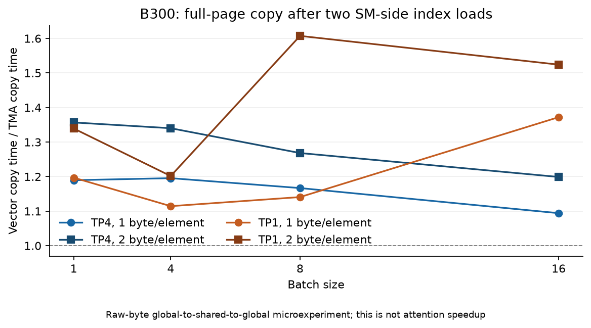
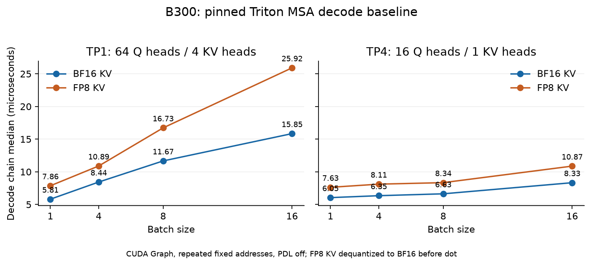
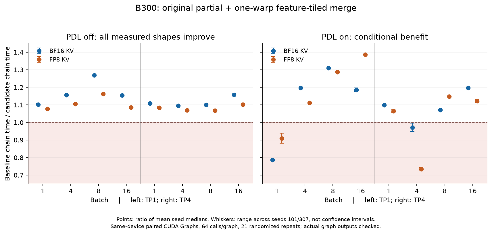

# C2：MiniMax M3 MSA 小 batch decode——测量、实现与验收

日期：2026-09-13。本文对应 [TASK.md](TASK.md) 的三个层次和六个讨论点；挑战选择 **(a) 改良 Triton**。理论推导全文见 [C2_THEORETICAL_ANALYSIS.md](analysis/C2_THEORETICAL_ANALYSIS.md)，逐项原始测量见文末证据索引。

**结果：保留原 partial，仅将 merge 改为单 warp、按输出通道分块，在课程 harness 的 PDL=false 条件下，16 个形状、两个独立 seed 全部变快，速度比 1.066–1.268×，几何平均 1.117×。最终候选通过冻结的 168 条 heldout 验收。PDL=true 时有四个形状组合退化，不能无条件替换生产路径。**

CUTLASS 的实测结果也不是统一在 B16 交叉：在所测离散点上，TP1 的 attention-only/full 首个获益点为 B8/B16；TP4 为 B32/B64。其 FP8 概率舍入还引入约 2.6% 的数学参考 NRMSE，必须与性能一起报告。

按用户确认，本次课堂环节以 [10 分钟答辩稿和问答](DEFENSE.md) 与 [内部独立审查记录](validation/INTERNAL_REVIEW.md) 交付。未向真实外组发布，未举行现场答辩；内部代理审查不被描述为真实课堂活动。冻结协议保留写定时的状态文字，后续进展由结果文件和本报告记录。

## 1. 实验对象与比较口径

|项目|本次固定值|
|---|---|
|vLLM 快照|`d4da0c55af3aa231b6209bf77871f3ed36eab0d2`，vendored 源码未修改|
|GPU|单卡 NVIDIA B300 SXM6 AC，CC 10.3，148 SM|
|软件|driver 580.95.05；CUDA toolkit 13.1.80；Torch 2.10.0+cu130；Triton 3.6.0；NCU 2025.4.1.0|
|注意力形状|D128，GQA16，top-k16，page128；TP1=64Q/4KV heads，TP4=16Q/1KV head|
|主性能矩阵|B1/4/8/16，seq8192，dql1，BF16 Q；BF16 KV 或 E4M3FN FP8 KV|
|FP8 主性能 scale|K/V 标量 0.25/0.5；非 2 幂、逐 token/head scale 另在完整验收中覆盖|
|页布局|随机物理页池；逻辑页经 block table 映射；top-k 为 token-major backing 的转置 view|

这里的 TP1/TP4 是**单卡上不同的 head 分片形状**，没有运行多 GPU 张量并行通信。用户允许 B300/B200，本次技术证据全部来自 B300；没有声称 B200 上复测过。

baseline 的 hot graph 每图 32 次调用、9 个样本；最终候选对照强化为每图 64 次调用、21 个交错样本、两个独立 seed。所有正式候选速度比均使用同一任务、同一物理 GPU、同一输入和相同 PDL 设置的 baseline。不同 Modal 任务未锁频，跨任务绝对时间仅作背景。

CUDA Graph 重复固定地址，不主动清缓存；这不保证全部数据驻留 L2。计时预先完成编译和 workspace 分配，测量完整 partial+merge 链，不含模型投影、indexer、Python 分配、网络或服务排队。NCU 的 `cache-control=all` 使用独立冷缓存重放，不能与 hot graph 时间相加或混算。采样 P95 也不是服务 p95。

## 2. 讨论点一：GQA 给 Tensor Core 留了空间，但小 batch 未必填满设备

对一个请求和一个 KV head，16 个 query heads 共同访问最多

\[
L=16\times128=2048
\]

个 token。令 G=16、D=128，FMA 按 2 FLOP：QK 与 PV 各约为 \(2GLD\)，合计

\[
F=4GLD=16{,}777{,}216\ \text{FLOP}.
\]

K/V payload 是 \(2LDs\) bytes，s 为每个元素的存储字节数，因此理想 KV 算术强度为

\[
AI_{KV}=\frac{4GLD}{2LDs}=\frac{2G}{s}
=\begin{cases}16&\text{BF16},\\32&\text{FP8}.\end{cases}
\]

TP1 B1 主矩阵乘约 67.1 MFLOP，BF16/FP8 KV 分别 4/2 MiB；TP4 为其四分之一。BF16 Q 与 output 在 TP1 各 16 KiB；只加入一次 Q 读和输出写后，强度约为 15.876/31.508 FLOP/B。索引、scale、重复 Q 读取、split workspace 和 spill 还会增加工作；cache 命中又会使 HBM 实际流量与逻辑字节不同。

这份算术强度依赖 GQA 的 KV 复用。若每个 query head 独立读一遍 KV，强度退化到约 1/2 FLOP/B。基线已经把 G=16 组织成矩阵 M 维；实际 SASS 为 `HMMA.16816.F32.BF16`，因此“decode 只有一行，Tensor Core 完全无用”不成立。FP8 KV 在当前 Triton 中先反量化到 BF16 再做 dot，不能使用 native FP8 峰值来评价它。

另一方面，Tensor Core 有效并不表示它已经成为全卡瓶颈。TP4 B1 的 partial 只有 16 个 CTA，而 GPU 有 148 SM；NCU tensor elapsed 仅 0.360%，DRAM read peak 仅 1.847%。这首先是工作规模和并行覆盖不足的证据。独立请求一般不共享 KV，增加 B 主要增加可并行工作，并不会自动增加每请求的 KV 算术强度。

## 3. 讨论点二：数学允许融合，调度收益仍要测

对一个 query head 的 split c，设 logits 为 \(z_j\)，定义

\[
Z_c=\sum_{j\in I_c}e^{z_j},\quad
o_c=Z_c^{-1}\sum_{j\in I_c}e^{z_j}v_j,\quad
\ell_c=\log_2Z_c.
\]

全局输出必须按 softmax 质量合并：

\[
o=\sum_c w_co_c,\qquad
w_c=\frac{2^{\ell_c-\ell_{\max}}}{\sum_d2^{\ell_d-\ell_{\max}}}.
\]

以上表达式假设该行至少有一个有效 token。空 split 在实现中写入局部输出 0、LSE 为 \(-\infty\)，使其合并权重为 0；全 padding 行的输出按接口契约忽略，不能用上述非空归一化公式定义其数值。

不能直接平均各 split 输出：例如 logits=[0,0,10]、V=[0,0,1]，前两个 token 与最后一个 token 分开，直接平均为 0.5，正确结果约 0.999909。原 partial 存 BF16 局部归一化输出和 FP32 log2-LSE；改变 split 或将中间结果提升精度，会改变有限精度归约路径，必须重新验收。

基线使用

\[
t=\max(1,\min(16,\lfloor256/(RH_{kv})\rfloor)),\qquad
S=2^{\lfloor\log_2t\rfloor},
\]

其中 R 为 flattened query 数，普通 decode 下 R=B。partial CTA 数为 \(RH_{kv}S\)，原 merge CTA 数为 \(RH_q\)。

|TP|B1 的 S/partial CTA|B4|B8|B16|
|---|---|---|---|---|
|1|16 / 64|16 / 256|8 / 256|4 / 256|
|4|16 / 16|16 / 64|16 / 128|16 / 256|

把整个 KV 集合塞到一个 CTA 可以去掉 merge，却会让 TP4 B1 只剩一个 CTA。cluster 可让多个 CTA 分别计算 split，在分布式共享内存中合并 \((m,l,a)\)；结合性支持这种数学组织。真正实现仍需显式处理远端数据可见性、barrier phase、producer/consumer 完成、buffer 重用和 cluster 生命周期。`mbarrier` 本身不会替任意全局 CTA 网格提供安全的全局汇合；自旋等待未调度 CTA 还可能死锁。相关语义见 [CUDA cluster 文档](https://docs.nvidia.com/cuda/cuda-programming-guide/01-introduction/programming-model.html#thread-block-clusters) 与 [PTX mbarrier](https://docs.nvidia.com/cuda/parallel-thread-execution/#parallel-synchronization-and-communication-instructions-mbarrier)。

本次没有实现 cluster attention，因而不声称 cluster 无收益。先测到的更小工程切口是 merge 内部布局：TP1 B1 BF16 的独立 merge 约占 chain 的 34.8%，B16 FP8 约占 15.2%。若假定这部分能够完全消除，可得约 1.53×/1.18× 的粗略 Amdahl 参照；由于独立 kernel 时间不严格与 chain 相加，它不是严格可兑现上界。

最终选择保留 split 和两 kernel 结构，减少 merge 的跨 warp 交换。PDL 开启后的反例说明：孤立 merge 变轻，也不自动保证有依赖 graph 的整链变快。

## 4. 讨论点三：TMA 能搬查表后的页，不能替 SM 追页表

真实访问链为

\[
\text{topk}[h,r,s]\to\text{logical page}\to
\text{block table}[request,logical]\to\text{physical page}.
\]

tensor map 描述规则的维度、stride、box、swizzle 等信息；不会把其中一个坐标当作另一张任意索引表，再自动加载其内容。做法是 SM 先取得物理页号，再以这个页号作为 TMA 动态坐标。依据是 [Driver tensor map API](https://docs.nvidia.com/cuda/cuda-driver-api/group__CUDA__TENSOR__MEMORY.html) 和 [PTX tensor copy](https://docs.nvidia.com/cuda/parallel-thread-execution/#data-movement-and-conversion-instructions-cp-async-bulk-tensor)。

为验证它，实现了 [paged_copy.cu](experiments/paged_copy.cu)。输入布局为 `[physical_page, Hkv, 128, 256]`，最后一维拼接 K/V；TMA box 为 `[256,128,1,1]`，坐标 `[0,0,head,physical_page]`。每个 CTA 128 线程，搬一个完整页，经 global→shared→global，与 128-bit SM 向量路径使用相同输出布局。

32 个配置全部通过 CPU 独立构造的逐字节 gold。实际 SASS 同时出现两次普通 `LDG.E` 和 `UTMALDG.4D`，验证了查表与规则搬运的分工。在 TP4 B1，2-byte 元素路径为 4.117→3.035 μs，1-byte 为 2.827→2.376 μs；完整配置的搬运速度比为约 1.09–1.61×。



这些是原始字节搬运结果，未做 QK、softmax、PV、FP8 scale 或页内流水线，不是 attention 加速。测试只搬合法完整页；真实集成还必须在查表前屏蔽无效 top-k 槽，并屏蔽已分配尾页中的未来 token。TMA 物理 OOB 机制不能表达 attention 的逻辑 causal mask。详见 [TMA_EXPERIMENT.md](experiments/TMA_EXPERIMENT.md)。

## 5. 讨论点四：scale 的数学位置与舍入位置都属于接口

用 \(a_j,b_j\) 表示 K/V scale：

\[
z_j=\alpha q^T(a_j\widehat k_j),\quad
p_j=\operatorname{softmax}(z)_j,\quad
o=\sum_jp_jb_j\widehat v_j.
\]

|scale 类型|精确算术下可移动的位置|必须保留的含义|
|---|---|---|
|共享 K scalar|合入 Q 或 softmax scale|必须在 max/exp/LSE 之前改变 logits|
|逐 token K scale|对应 logit 列|不能变成统一输出缩放|
|共享 V scalar|PV 之前或输出之后|只改变值的加权和|
|逐 token V scale|V 或 PV 的 probability numerator|分母仍用原 softmax 质量，不能重新归一化 `p*b`|

逐 token/head scale 的下标是 `physical_page*128+offset`。它必须随物理 KV 页一致重映射，不能用逻辑页、query 位置或 top-k 槽号代替。

本题 Triton 实际执行 FP8→BF16，乘 FP32 scale，再舍入 BF16，随后做 BF16 dot。把 scale 移到 FP32 logit 或最终输出，即使代数成立也改变舍入。最终候选保留原 partial，因而保留这条精度路径。

上游 scale 回归测试主要用单页、单 KV head、常数 0.25/0.5；它能发现完全漏 scale，但不足以检出物理页/逻辑页混淆、head 错位和把不同 token scale 当成常数。本次冻结 suite 加入非 2 幂 0.37/0.63、真实变化的物理 token/head scale、stride=2 backing、页重排和不同 K/V scale，并全部跑完 heldout。

## 6. 讨论点五：先 profile，再选择局部改动

测量顺序保存在 [CANDIDATE_DESIGN.md](experiments/CANDIDATE_DESIGN.md)：baseline 全矩阵 `015939Z`、首个 NCU `015957Z` 成功后才实现候选；随后取得 `020433Z` 的其他 NCU 切面，再提出单独修改 merge。保留所有探索和失败产物，不从赢家反写最初假设。



完整数据见 [BASELINE_PROFILE.md](experiments/BASELINE_PROFILE.md)。代表性冷 NCU 证据如下：

|形状 / kernel|cold μs|DRAM read MB|DRAM read peak|tensor elapsed|说明|
|---|---:|---:|---:|---:|---|
|TP4 B1 BF16 partial|7.648|1.076|1.847%|0.360%|16 CTA，active occupancy 6.36%，远未填满设备|
|TP1 B16 BF16 partial|19.968|67.404|44.010%|9.176%|随工作增大，内存压力更显著|
|TP1 B16 FP8 partial|27.712|33.865|15.945%|6.600%|读量减半却更慢，不能只用 HBM 字节解释|

partial 默认 4 warps、3 stages、73,732 B dynamic shared。BF16 B1 使用 168 regs/thread、B≥4 使用 211；FP8 B1 为 195、B≥4 为 168。FP8 大 batch 编译元数据 `n_spills=2`，B16 NCU 还测得 2,048 个 local spilling requests，SASS 有 STL/LDL；不能说所有配置都没有 spill。

FP8 SASS 包含额外 unpack、F16→BF16 转换和乘 scale。TP1 B16 FP8 shared wavefront 为 2,824,704，理想值 2,005,504；BF16 为 1,546,752，恰等于理想值。这支持反量化、布局交换和部分 spill 参与代价的解释，但静态指令数不能当作动态耗时占比。

merge 的改进空间更直接：TP1 B1 的实际/理想 shared wavefront 为 69,888/8,448，B16 为 577,536/86,016。候选 NCU 测得它们降为 640/640 和 0/0，两个代表点均无 excess wavefront、无 local spill。变化与减少跨 warp 布局/归约工作一致。不同任务的冷 NCU 只用于机制分析，正式收益来自下节同卡整链对照。

## 7. 挑战实现：原 partial + 单 warp feature-tiled merge

[candidate.py](candidate.py) 中 `_page_decode_kernel` 与 vendored partial 仅名称不同，AST 检查覆盖装饰器、参数和函数体。默认策略保留原 split、4 warps/3 stages、BF16 partial、FP32 LSE 及 FP8 反量化路径。只把 merge 改为一个 warp：S≤8 时每 CTA 写128个输出通道；S=16 时写64个通道。

最初也实现了 32/64/128-token 子页 partial，扫描 token tile、split、warp、stage，保留在实验接口中。240 个主矩阵探索配置里，部分 FP8 有收益，BF16 多数不利；它不是最终默认。merge 单独探索 192 配置后，以 seed0 数据固定简单策略，再用 seeds101/307 做最终验证和性能复测。未根据 PDL 负结果重新挑 dispatch 来掩盖退化。

最终源码 SHA256：`3e4a2ff87b352c7398ce814cf7ea81cf4e4c1fea33fbb5fe6bec8ee115644773`，与最终 verify/paired 上传快照一致。



图中点为两个 seed 各自中位时间的均值之比，误差棒为两 seed 速度比范围，不是置信区间。每个 repeat 随机决定 baseline/candidate 先后顺序。最终 64 条性能记录包含实际 graph 重放后的输出检查，baseline/candidate 均 finite 且 NRMSE<0.02；检查位于计时区间之外。

|同卡代表点|baseline μs|candidate μs|速度比|
|---|---:|---:|---:|
|PDL off，TP1 B1 BF16|5.913|5.363|1.103×|
|PDL off，TP1 B8 BF16|11.580|9.131|1.268×|
|PDL off，TP1 B16 FP8|25.866|23.831|1.085×|
|PDL off，TP4 B1 BF16|5.975|5.393|1.108×|
|PDL off，TP4 B16 FP8|10.765|9.769|1.102×|
|PDL on，TP1 B1 BF16|5.383|6.842|0.787×|
|PDL on，TP4 B4 FP8|7.337|9.997|0.734×|

PDL=false 的 32 个 seed/形状速度比为 **1.066–1.268×**，几何平均 **1.117×**，对应延迟下降约 **6.2%–21.2%**。速度比提高 26.8% 不能写成延迟降低 26.8%。

PDL=true 范围为 **0.724–1.388×**；TP1 B1 的两 dtype 和 TP4 B4 的两 dtype 均存在退化。尚未采集这些退化点的完整 PDL 时间线，不能把某一种调度解释当作定论。本次结论是非 PDL 课程域内的改良实现有收益；生产推广需要单独验证 dispatch、PDL 组织和真实 workload。

全部 32 行聚合表、两个 seed 范围和 NCU 资源表见 [CANDIDATE_EXPERIMENTS.md](experiments/CANDIDATE_EXPERIMENTS.md)。

## 8. CUTLASS 对照：B16 是上游策略门槛，不是普遍定律

从固定 vLLM CMake 找到实际外部实现并构建：MSA pin `087c161814d4d9c735b46c21212a09e5f8eb92fa`，CUTLASS pin `eb61c911471867a5fd2466bfd8f29306cea6ebf8`。decode planner、CUDA kernel 和 reduction 均未修改；仅对未使用的 CuTe prefill adapter 做显式拒绝 stub，避免无关依赖。

两端使用同一请求、页表和 FP8 KV。Triton 使用 BF16 Q、PDL=true；CUTLASS 额外使用 FP8 Q，Q/K/V scale=0.25/0.25/0.5。`attention` 包含 forward 和计划选中的 reduction；`full` 另含本实验普通 PyTorch 多步 Q 量化与 GPU metadata 更新。两者都使用热 plan，排除冷编译和 CPU 准备，因此 full 不是服务端到端，也不代表生产融合量化的最低成本。

|TP|B|Triton μs|CUTLASS attention μs|CUTLASS full μs|
|---|---:|---:|---:|---:|
|1|1|7.507|16.041|25.456|
|1|8|20.099|16.899|27.663|
|1|16|32.140|17.477|28.515|
|1|64|89.645|36.114|51.109|
|4|1|7.202|16.270|26.420|
|4|16|12.143|17.003|27.432|
|4|32|20.080|17.060|27.269|
|4|64|32.154|18.270|28.907|

每一行是同卡对照；小 batch 与大 batch 来自不同任务，不据它们之间的小绝对差作因果推断。B<16 是实验性直接调用底层路径，绕过原 dispatch guard。包含 B4 和全部误差的完整表见 [CUTLASS_EXPERIMENTS.md](experiments/CUTLASS_EXPERIMENTS.md)。

所测离散点中，TP1 attention/full 首次获益为 B8/B16，TP4 为 B32/B64；没有测所有中间整数 batch，所以不宣称精确交点。尤其 TP4 B16 没有复现上游注释的 crossover。

实际 forward 为 148 CTA、每 CTA 384 线程、168 regs/thread、约181 KB shared，SASS 确认 `UTMALDG.4D` 和 `UTCQMMA`。GQA pack_factor=16；部分形状使用 split-KV=4 并调用 reduction，并非总是单 kernel。固定148 CTA 也不等于148 SM持续执行有效工作。较重的启动/计划/布局成本在小 B 难以摊薄，更大 B 才可能释放 TMA 与 native FP8 的收益；这是与数据一致的解释，不能从 CTA 数单独推出 B16。

精度差异不能略去。即便对齐有效 FP8 Q，CUTLASS 相对 FP64 attention 仍有约 0.026–0.028 NRMSE，而 Triton 约0.003。固定源码将 exp 后的 probability numerator 转为输入 Element，即 E4M3；SASS 也有 FP8 pack。独立重复单页控制中，对数学 FP64 参考的误差为0.026060，对独立 FP8-P numerator 参考降到0.001681；Q=0、numerator=1 可精确表示时为0.001663。它们共同支持主要额外误差来自 P 的 FP8 舍入。

CUTLASS 对照未执行完整冻结候选 gate，不能声称取得该验收资格；也没有为其约 2.6% 的诊断误差调宽阈值。当前结果用于研究性能/精度交叉，不作为同精度替代资格。固定版本、源码行、SASS 和控制实验均在专项报告中可追溯。

## 9. 讨论点六：独立参考、先冻结门槛，再 heldout

[ACCEPTANCE.md](validation/ACCEPTANCE.md)、[suite.py](validation/suite.py) 与 [run_validation.py](validation/run_validation.py) 构成冻结协议。gold 显式按有效 top-k、逻辑 causal 位置和物理页收集 K/V，再计算 FP64 QK、减最大值、exp、归一化和 PV；不调用 baseline、候选、SDPA 或 split/online merge。

FP8 gold 先按基线口径得到 BF16 有效 K/V，再升 FP64 做 attention；它衡量 kernel 对同一表示输入的数值误差，不包括未量化模型质量。`raw_scale_gold` 另行保留 FP64 直接乘 scale 的诊断口径，不混用。

校准 seeds11/29，只用 baseline，生成168条记录；协议常数预先限定 baseline 最大误差的有限倍数、floor 和 cap。关键硬限包括 maxabs≤0.02、逐行 NRMSE≤0.10、全局相对 L2≤0.05、逐元素 `atol=rtol=0.02`，并要求所有 active 输出 finite。逐行 NRMSE 分母为 `max(reference_RMS,0.01)`，避免仅用全局 L2 隐藏局部错误。每个输入族实际阈值由预定公式冻结，不等于一律使用最宽 cap。

manifest 保存协议文件、vendored baseline 和 shim 哈希；验证重算 digest，不一致即拒绝复用。校准失败、未跑完或 heldout baseline 失败都不能记为 candidate PASS。固定协议 digest 为

`430cf4da832b3fb3d2e3eeb2bff0c31959101a05703cc2ede89a1e10c4c54b02`。

|阶段|记录数|状态|说明|
|---|---:|---|---|
|baseline calibration|168|CALIBRATION_FROZEN|最大绝对误差0.00693823，最大逐行NRMSE0.00380283|
|heldout baseline，seeds101/307|168|PASS|未触发 baseline 前置失败|
|最终 merge-only candidate heldout|168|PASS|最大绝对误差0.00926627，最大逐行NRMSE0.00397399|
|最终 paired 的 graph 后检查|64组、128份输出|全部通过|覆盖相同输入/PDL 下真正被计时的 graph；不替代完整边界 suite|

覆盖 BF16/FP8 scalar/FP8 token-head 三类存储、TP1/4、B1/4/8/16、短序列跨128页边界、dql2/4、长8192、物理页重排、top-k 顺序置换、strided scale、未选中页/未来 token 的合法地址 NaN poison、Q=0、常量 V、sharp logits、消去、空 split、混合及全 padding。强 causal probe 让最后一个 token V=8、早 query 应为0，使泄漏容易检出。

padding 输出按契约忽略，允许 NaN 或零；它不能污染 active 邻行。所有变形都先由独立 gold 验证不变量。内部审查在候选 GPU 实测前完成，并留下修正记录；真实外组流程按用户确认以此材料替代交付。

该 PASS 限于冻结域。未执行 compute-sanitizer、真实共享 prefix、其他 head ratio/FP16 Q/FP8 格式或完整服务回归；性能 graph 对 PDL 的补充检查也没有把整个冻结边界集变成生产 PDL 验收。

## 10. 工程判断与复现入口

本次挑战支持维护一个可审查的非 PDL merge 改进：保留原 partial 的计算与 scale 语义，收益在独立 seed 上重复出现，机制有 NCU 支持。它不支持直接发布通用生产替代：PDL 退化、真实服务输入、页共享、其他形状和量化精度都仍需要单独验证。

如果继续优化，最值得检验的是 PDL 下 merge 调度与 feature 分块的交互，以及 FP8 反量化/布局成本。cluster 融合和 native FP8 是更大的实现变化；应先证明目标请求分布中的绝对延迟收益值得承担新的同步和数值支持范围。现有证据没有给出未经测量的工程人日或服务吞吐承诺。

从仓库根目录运行。Modal 命令会重新上传必要源码并产生 GPU 费用；本次运行已获用户授权且均已结束。`--offline` 只约束本地 uv 依赖解析，Modal 本身仍需要网络、凭据与可用额度；若本机尚未缓存 modal1.5.5，首次安装需去掉此开关。

```bash
# CPU 理论检查和从已保存结果重建报告，无 GPU 费用
python3 assignment02/team/c2_msa_decode/analysis/theory_checks.py
python3 assignment02/team/c2_msa_decode/experiments/summarize_baseline.py
python3 assignment02/team/c2_msa_decode/experiments/summarize_copy.py
python3 assignment02/team/c2_msa_decode/experiments/summarize_candidate.py
python3 assignment02/team/c2_msa_decode/experiments/summarize_cutlass.py

# 原始 baseline：默认 PDL=false；第二条为 PDL=true 的完整矩阵
uv --cache-dir /private/tmp/a02-uv-cache run --offline --no-project --with modal==1.5.5 python -m modal run assignment02/team/c2_msa_decode/experiments/modal_baseline.py --mode bench
uv --cache-dir /private/tmp/a02-uv-cache run --offline --no-project --with modal==1.5.5 python -m modal run assignment02/team/c2_msa_decode/experiments/modal_baseline.py --mode bench --pdl

# NCU：默认 TP4 B1 BF16；额外矩阵为 TP1 B1/B16、TP4 B16 的两种 dtype
uv --cache-dir /private/tmp/a02-uv-cache run --offline --no-project --with modal==1.5.5 python -m modal run assignment02/team/c2_msa_decode/experiments/modal_baseline.py --mode profile
uv --cache-dir /private/tmp/a02-uv-cache run --offline --no-project --with modal==1.5.5 python -m modal run assignment02/team/c2_msa_decode/experiments/modal_baseline.py --mode profile-matrix

# 固定上游 CUTLASS：两条均默认 tps=1,4、Triton PDL=true
uv --cache-dir /private/tmp/a02-uv-cache run --offline --no-project --with modal==1.5.5 python -m modal run assignment02/team/c2_msa_decode/experiments/modal_cutlass.py --batches 16,32,64
uv --cache-dir /private/tmp/a02-uv-cache run --offline --no-project --with modal==1.5.5 python -m modal run assignment02/team/c2_msa_decode/experiments/modal_cutlass.py --batches 1,4,8,16 --controls

# 独立 TMA 微实验
uv --cache-dir /private/tmp/a02-uv-cache run --offline --no-project --with modal==1.5.5 python -m modal run assignment02/team/c2_msa_decode/modal_copy.py

# 最终候选：使用已冻结 manifest；重校准须使用新输出目录
uv --cache-dir /private/tmp/a02-uv-cache run --offline --no-project --with modal==1.5.5 python -m modal run assignment02/team/c2_msa_decode/modal_candidate.py --mode verify --manifest assignment02/team/c2_msa_decode/results/candidate-calibrate-20260913T020759Z/calibration.json
uv --cache-dir /private/tmp/a02-uv-cache run --offline --no-project --with modal==1.5.5 python -m modal run assignment02/team/c2_msa_decode/modal_candidate.py --mode paired
uv --cache-dir /private/tmp/a02-uv-cache run --offline --no-project --with modal==1.5.5 python -m modal run assignment02/team/c2_msa_decode/modal_candidate.py --mode profile
```

CUTLASS 运行器通过 `--batches` 选择矩阵，通过 `--controls` 追加独立 FP8-P 诊断，没有 `small`/`wide` 模式。首次运行包含固定公开依赖下载与 CUDA 编译；可将环境变量 `C2_CUTLASS_WARM_CACHE` 设为仓库根目录相对路径 `assignment02/team/c2_msa_decode/experiments/results/cutlass-b300-20260913T020942Z/compile-cache`，复用其中的 `.so`，具体依赖及上传规则见 [modal_cutlass.py](experiments/modal_cutlass.py)。候选 `tune`/`merge` 仅用于复现探索，不代表重新选择最终策略。最终理论、测量与交付入口如下。

|证据|入口|
|---|---|
|完整理论推导与 CPU 反例|[C2_THEORETICAL_ANALYSIS.md](analysis/C2_THEORETICAL_ANALYSIS.md)|
|基线全矩阵、PDL、7个 NCU 代表点|[BASELINE_PROFILE.md](experiments/BASELINE_PROFILE.md)|
|TMA 32配置和 SASS|[TMA_EXPERIMENT.md](experiments/TMA_EXPERIMENT.md)|
|先测后设计记录|[CANDIDATE_DESIGN.md](experiments/CANDIDATE_DESIGN.md)|
|最终候选全表与测量协议|[CANDIDATE_EXPERIMENTS.md](experiments/CANDIDATE_EXPERIMENTS.md)|
|最终性能原始21样本、顺序、graph 输出检查|[paired.json](results/candidate-paired-20260913T022747Z/paired.json)|
|冻结校准 / 最终 heldout|[calibration.json](results/candidate-calibrate-20260913T020759Z/calibration.json) / [candidate-heldout.json](results/candidate-verify-20260913T022150Z/candidate-heldout.json)|
|固定 CUTLASS 构建、交叉点和 FP8-P 控制|[CUTLASS_EXPERIMENTS.md](experiments/CUTLASS_EXPERIMENTS.md)|
|答辩 / 内部审查|[DEFENSE.md](DEFENSE.md) / [INTERNAL_REVIEW.md](validation/INTERNAL_REVIEW.md)|

候选任务保留上传文件的完整源码快照；baseline/CUTLASS 任务保留运行器与 workload 快照、固定上游版本及环境、命令、stdout 和结构化结果；TMA 任务记录 CUDA 源码哈希与命令输出。NCU 任务另存 `.ncu-rep` 与 CSV，相关编译产物保留 SASS。早期失败和未选中候选保留为实验历史，最终结论只采用上表明确引用的成功结果。
