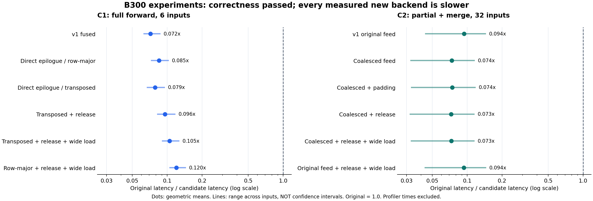

# C1 / C2 新指令探索：阶段性报告

日期：2026-09-17。账户：`simidawhu`；实际设备：Modal B300，sm_103a。

## 阶段结论

本轮已实现并实测 **C1 六个、C2 六个完整 tcgen05 后端变体**，完成原门槛验收、完整算子配对计时、NCU诊断及最终独立输入验证。**正确性得到验证，性能替代目标尚未达到：12个版本都没有超过旧实现。** 按用户要求，本阶段到此结束，后续方向只作记录。

| 项目 | 本轮新后端的最好样本结果 | 相对旧版的几何平均延迟 | 最终正确性 |
|---|---:|---:|---|
| C1 | 速度比0.120046× | 约8.33倍 | 原38/38逐位一致；独立长链4/4逐位一致 |
| C2 | 速度比0.093990× | 约10.64倍 | 原168/168；独立新输入192/192，均沿原冻结门槛 |

速度比统一定义为“旧版延迟÷新候选延迟”，小于1表示更慢。C1首版为0.071752×，后续改动确有改善，但不足以追上旧版。C2 `original_wide`为0.093713×，与首版差约0.3%，不能称为显著胜负；按事前的样本几何均值选择规则冻结首版做最终独立验证。

图中圆点为几何均值，横线为不同输入的范围，**不是置信区间**。C1/C2计时方式不同，不能互比绝对时延。

## 完成了什么

- 实现C1完整多chunk K2及forward，保留C16、固定上游K1、BF16舍入边界、varlen和初末状态接口。三段矩阵计算真正执行tcgen05；并非只测单tile。
- 实现C2完整分页partial，与merge组成完整attention链；覆盖页表、top-k、causal尾页、空split、BF16与FP8存储scale语义。所有正式测试实际进入新partial，无fallback。FP8存储兼容仍采用BF16 MMA，不能称原生FP8 MMA。
- 建立不可覆盖的run快照，记录源码hash、编译flags、binary、SASS、原始命令、退出码、数值结果、配对样本和profiler产物。先CPU编译再分配GPU；失败和超时均保留。
- 固定FlashKDA `1ce47ea3`、CUTLASS `5c149f52`、CUDA13.1、Torch2.10.0+cu130、Triton3.6.0。未放宽原验收标准。

## C1：实验过程与结果

| 版本 | 相对前一步检验的因素 | 六形状速度比几何均值 | 原门槛 |
|---|---|---:|---|
| fused | tcgen05完整计算，FP32 shared scratch | 0.071752× | 38/38 |
| direct-rowmajor | 直接消费TMEM结果，去掉scratch | 0.085133× | 38/38 |
| direct | 再改变state/U/base物理布局 | 0.078748× | 38/38 |
| direct-release | direct增加-DNDEBUG | 0.095781× | 38/38 |
| direct-wide | release再将TMEM读取1x改16x | 0.104891× | 38/38 |
| direct-wide-rowmajor | 宽读取组合恢复row-major | **0.120046×** | 38/38 |

每次run与同次旧版交错计时，包含binding/beta准备，排除workspace分配；H12/H96×单序列8192、6段varlen、8×1024，共6形状、5轮AB/BA。跨run比值只作描述性消融比较，不冒充所有变体在同一会话中的严格因果估计。关闭CUDA调试断言没有关闭数值验收。

最终候选完整forward结果，单位µs：

| H | 输入组织 | 旧版 | 新候选 | 速度比 |
|---:|---|---:|---:|---:|
| 12 | 1×8192 | 832.595 | 7878.068 | 0.105685× |
| 12 | varlen，合计8192 | 355.171 | 3032.217 | 0.117133× |
| 12 | 8×1024 | 154.085 | 1073.850 | 0.143488× |
| 96 | 1×8192 | 1072.452 | 8320.481 | 0.128893× |
| 96 | varlen，合计8192 | 884.560 | 7493.858 | 0.118038× |
| 96 | 8×1024 | 697.470 | 6297.987 | 0.110745× |

[完整38例验收](runs/20260917T001102039698Z-c1-verify/artifacts/verify-direct-wide-rowmajor.json)包含原30例与8个状态接口组合；[正式计时](runs/20260917T001511217589Z-c1-bench/artifacts/bench-direct-wide-rowmajor.json)保留全部样本及计时后检查。

[独立长链验证](runs/20260917T001710059492Z-c1-verify/artifacts/long-verify-direct-wide-rowmajor.json)：预先指定seed20260917，同一32768长度输入的8192/32768前缀，random/weak_decay两类gate，共4/4输出及末state逐位一致。对独立数学参考的output relative RMSE约0.005204、0.005231、0.007902、0.007977，与旧版相同。**位等值是相对旧舍入实现，不表示数学误差为零。**

### 为什么仍然慢

H96/T8192的[旧版NCU](runs/20260917T001950764975Z-c1-profile/artifacts/profile.csv)与[最终新候选NCU](runs/20260917T001710083225Z-c1-profile/artifacts/profile.csv)给出了关键对照：

- 旧、新K2都为96 CTA。旧版192线程含4个计算warp、TMA load/store各1个warp；新候选128线程，采用普通标量供数。不能单用CTA少解释差距。
- 动态指令约184.31M→564.75M，shared额外wavefront从0→254.80M。两者DRAM读取约885.6MB，几乎相同，问题并不是新版本必须读取十倍数据。
- 旧版标量global-load计数为0不表示没读显存：它使用TMA，计数器口径不同。新版本产生约41.73M标量global-load请求。
- 相对新后端首版，最终版TMEM动态load确实从37,748,736降到2,359,296，dynamic shared从163,968B降到90,240B；但直接写回BF16 state/U仍有片上冲突。去掉一个buffer不意味着所有访问都更高效。

因此，有证据支持“迁移MMA时丢失了基线的数据搬运优势，新的结果写回布局仍有成本”。不能把某个PC采样百分比当作精确耗时份额，也不能把代表形状的profile推广为所有输入的唯一归因。细节见[C1机制分析](../c1_flashkda/nextgen/PROFILE_ANALYSIS.md)。

## C2：实验过程与结果

| 版本 | 关键变化 | 32组速度比几何均值 | 原门槛 |
|---|---|---:|---|
| original | 完整转置QK/PV、普通线程供数 | **0.093990×** | 168/168 |
| coalesced | 改变全局供数遍历 | 0.073612× | 168/168 |
| coalesced_pad17 | scratch stride16→17，修复对齐后 | 0.074330× | 168/168 |
| coalesced_release | coalesced增加-DNDEBUG | 0.072679× | 168/168 |
| coalesced_wide | release再增加TMEM16x读取 | 0.072943× | 168/168 |
| original_wide | 宽读取组合恢复original feed | 0.093713× | 168/168 |

正式计时覆盖TP1/4、batch1/4/8/16、BF16/FP8 scalar存储、seed101/307，共32组、7轮随机配对，比较原版、旧merge-only、新partial+同merge三条完整链。使用热地址CUDA Graph，按最快路径选择约10ms采样区间；计时前后复验冻结family门槛。

首版代表TP1/B1/BF16/seed101：原版5.682µs，旧merge-only5.057µs，新版43.828µs；TP1/B16同族为15.709、13.589、356.839µs。全部32组落后。[完整验收](runs/20260916T155241079346Z-c2-verify/artifacts/heldout.json)与[计时原始数据](runs/20260916T155513744579Z-c2-bench/artifacts/paired.json)均保留。

[最终独立验证](runs/20260917T002438596636Z-c2-verify/artifacts/extra-heldout.json)已通过：预登记seed20260917/20261003，既有形状的新样本168条，加B2/DQL3及B7不等长尾页等24条，共 **baseline192/192、candidate192/192**。候选源码、binary和分派规则在生成新输入前冻结；沿用原protocol和family阈值，没有重新校准。

### 有用的负结果

同形状NCU中，coalesced将global excessive理论量从1.040384MB降为0，shared额外wavefront从413696降为348160；pad17再降为208896。**这些计数改善并未换来完整链提速。** BF16寄存器70→102/115，但coalesced的shared驻留上限和实测active warps基本未变，不能直接归因于“寄存器增加导致occupancy明显下降”。精确剩余归因仍未完全解决，详见[统一机制分析](PROFILE_ANALYSIS.md)。

pad17首次发生misaligned address：数组基址128B对齐，不保证68B行距上的每一行都满足16B向量对齐。仅将该分支两处写回限制为32bit对齐后，smoke与完整验收通过。

另一次pad17正式benchmark在首行前超时700秒，没有有效性能数据。现场CPU忙、GPU利用率快照为0%；[分阶段诊断](runs/20260917T001806257176Z-c2-smoke/artifacts/progress.json)随后通过三条路径、Graph2/8/16/64的24次重放及39次检查。[相同源码和binary的新容器重跑](runs/20260917T002053460597Z-c2-bench/artifacts/paired.json)完成32组。原因未复现，不能声称已定位为内核死锁或平台故障；原超时仍保留。

## 下一阶段可探索的方向——本轮未继续实施

1. **C1保留或恢复现有TMA供数与warp分工，再替换计算阶段。** 同时设计persistent state、UMMA操作数、TMEM epilogue的共享布局，减少重新打包和冲突；避免反复从global读取每个key共享的gate数据。
2. **C1允许混合指令后端。** 小三角变换、状态投影和状态更新的形状及依赖不同，逐阶段证明收益后再组合，不强制所有阶段换成tcgen05。改变chunk或状态精度需另立数值协议。
3. **C2检验真正的异步供数及合适shared布局。** TMA、合法swizzle和split调度应一起评估。每CTA只有一页时没有页间流水机会，不能默认增加stage就会更快。原生FP8 MMA另行研究。

这些是证据支持的待测方向，不是已经实现的收益。本轮没有测试B200、PDL新后端、原生FP8 MMA、模型质量或服务端到端，也没有证明新指令在其他形状上不可能胜出。

## 交付与复现

- [逐次思路、步骤和失败记录](JOURNAL.md)、[实验前假设](HYPOTHESES.md)、[验收协议](ACCEPTANCE.md)。
- [全部运行索引](RUN_INDEX.json)、[12个正式benchmark汇总](benchmark_summary.csv)、[可导出的SVG图](performance_comparison.svg)。
- [C1设计与实现](../c1_flashkda/nextgen/DESIGN.md)、[C2设计与实现](../c2_msa_decode/nextgen/DESIGN.md)。
- [运行说明](README.md)：`prepare_run.py`冻结源码，`modal_runner.py`执行限时CPU构建/GPU实验。复现旧版本时使用该run的`--candidate-dir`源快照；复用binary前会检查编译源、参数和包hash。
- `summarize_runs.py --write`重新生成索引；`plot_results.py`只汇总完整、成功的正式benchmark，不纳入profiler与失败运行。

简历可以据实强调“完整新后端、冻结数值验收、配对性能实验与数据流瓶颈定位”；本轮数据不支持写成“tcgen05后端相对原版加速”。
