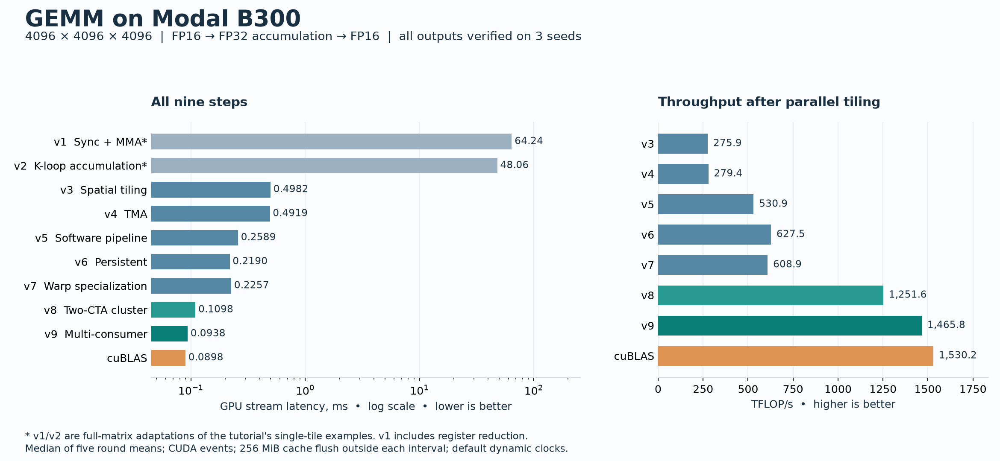

# Modal B300：教程九个 GEMM 版本实测

运行目录：`20260918T085349Z`。原始状态：`complete`。
九个版本及 cuBLAS 均完成正确性检查和计时。

运算为 `D = A @ B.T`，`M×N×K = 4096×4096×4096`，FP16 input/output, FP32 accumulation。
延迟取各轮平均延迟的中位数；TFLOPS 按 `2MNK / 时间` 计算。cuBLAS 百分比表示吞吐比（cuBLAS 延迟 / 当前延迟），超过 100% 表示本次测量更快。

| 版本 | 优化步骤 | 延迟 ms | TFLOPS | 相对 v1 | cuBLAS 吞吐比 | 轮均值范围 ms | 轮间 CV | 样本数 |
|---|---|---:|---:|---:|---:|---:|---:|---:|
| v1 | 同步加载 + MMA（全矩阵适配） | 64.2382 | 2.14 | 1.00× | 0.14% | 64.2277–64.2876 | 0.04% | 25（5 轮） |
| v2 | K 循环在 TMEM 累加（全矩阵适配） | 48.0616 | 2.86 | 1.34× | 0.19% | 48.0379–48.0848 | 0.03% | 25（5 轮） |
| v3 | 空间分块、多 CTA | 0.4982 | 275.88 | 128.95× | 18.03% | 0.4980–0.4983 | 0.02% | 1000（5 轮） |
| v4 | TMA 异步加载 | 0.4919 | 279.39 | 130.58× | 18.26% | 0.4919–0.4920 | 0.01% | 1000（5 轮） |
| v5 | 软件流水线 | 0.2589 | 530.87 | 248.12× | 34.69% | 0.2588–0.2590 | 0.03% | 1000（5 轮） |
| v6 | 持久化 kernel | 0.2190 | 627.52 | 293.30× | 41.01% | 0.2188–0.2191 | 0.05% | 1000（5 轮） |
| v7 | Warp specialization | 0.2257 | 608.86 | 284.58× | 39.79% | 0.2255–0.2257 | 0.04% | 1000（5 轮） |
| v8 | 双 CTA cluster | 0.1098 | 1251.64 | 585.01× | 81.79% | 0.1095–0.1100 | 0.21% | 1000（5 轮） |
| v9 | 多消费者 | 0.0938 | 1465.83 | 685.12× | 95.79% | 0.0937–0.0943 | 0.26% | 1000（5 轮） |
| cuBLAS | cuBLAS / torch.mm | 0.0898 | 1530.23 | 715.22× | 100.00% | 0.0894–0.0906 | 0.53% | 1000（5 轮） |

本次九个实现中，v9 的延迟最低：0.0938 ms，1465.83 TFLOPS，为 cuBLAS 吞吐的 95.79%。接近的结果需结合轮间波动解释。

这次运行中的主要变化：

- v2→v3：多 CTA 空间分块后快 96.48×。
- v3→v4：吞吐仅提升 1.27%；当前源码没有复现原表这一段的巨大差距。
- v4→v5：软件流水线后快 1.90×。
- v6→v7：warp specialization 的延迟反而增加 3.07%。这是本次参数下的观测，尚未用 profiler 定位原因。
- v7→v8：双 CTA cluster 后快 2.06×；v8→v9 再快 1.17×。



## 正确性

参考：torch FP32 GEMM with TF32 disabled, rounded to FP16。逐元素容差为 `abs(actual−reference) ≤ 0.01 + 0.02 × abs(reference)`。每次检查先将输出填为 NaN，再检查完整矩阵及有限值。
共同随机种子：`[0, 1, 2]`。下表误差为各个种子中的最大值，失败元素数为所有检查之和。

| 版本 | 种子 | 检查 | 最大绝对误差 | 最大 RMS 误差 | 最大相对 L2 误差 | 失败元素数 |
|---|---|---|---:|---:|---:|---:|
| v1 | 0,1,2 | 通过 | 0.250000 | 0.001583 | 0.00002474 | 0 |
| v2 | 0,1,2 | 通过 | 0.250000 | 0.003582 | 0.00005595 | 0 |
| v3 | 0,1,2 | 通过 | 0.250000 | 0.003582 | 0.00005595 | 0 |
| v4 | 0,1,2 | 通过 | 0.250000 | 0.003582 | 0.00005595 | 0 |
| v5 | 0,1,2 | 通过 | 0.250000 | 0.003582 | 0.00005595 | 0 |
| v6 | 0,1,2 | 通过 | 0.250000 | 0.003582 | 0.00005595 | 0 |
| v7 | 0,1,2 | 通过 | 0.250000 | 0.003582 | 0.00005595 | 0 |
| v8 | 0,1,2 | 通过 | 0.250000 | 0.003582 | 0.00005595 | 0 |
| v9 | 0,1,2 | 通过 | 0.250000 | 0.003582 | 0.00005595 | 0 |
| cuBLAS | 0,1,2 | 通过 | 0.250000 | 0.003582 | 0.00005595 | 0 |

## 测量条件

计时器：CUDA events on default stream, one interval per complete GEMM。每个区间覆盖完整 GEMM，CUDA event 区间可能包含主机提交空隙，因此不等同于 profiler 的 kernel 指令执行时间。
缓存策略：256 MiB buffer zeroed before every measured invocation, outside events。该策略用于减少输入热缓存影响，未直接验证每条 cache line 均被驱逐。
预热：At least 5 calls and about 200 ms, capped at 500 calls。每轮次数：per-round count min(requested, max(5, ceil(200ms/calibration_ms)))。
排除项：compilation, allocation, input generation, reference, correctness checking, 256 MiB cache flush。输入 strides：`{"A": [4096, 1], "B": [4096, 1]}`。
各轮运行顺序（0 为 cuBLAS）：`[[2, 8, 6, 7, 9, 4, 0, 1, 3, 5], [1, 0, 5, 4, 8, 9, 7, 3, 6, 2], [1, 9, 6, 2, 8, 7, 4, 3, 5, 0], [3, 6, 5, 8, 2, 7, 9, 0, 1, 4], [3, 9, 4, 0, 7, 8, 5, 1, 2, 6]]`。
调优策略：Tutorial parameters retained, no per-version autotuning。

## 环境与遥测

设备：NVIDIA B300 SXM6 AC；SM 数：148；compute capability：10.3；显存：267.69 GiB (287428771840 bytes)。
运行平台：Modal；请求 GPU：B300；编译目标：`sm_103a`；CUDA stream：`0`。
PyTorch CUDA：`13.0`；时钟策略：Default dynamic clocks; no clock or power changes。
软件版本：`torch=2.10.0+cu130`；`apache-tvm=0.26.0`；`apache-tvm-ffi=0.1.14.post0`；`cuda-bindings=13.0.3`；`triton=3.6.0`；`numpy=2.2.6`；`nvidia-cublas=13.1.0.3`；`nvidia-cuda-runtime=13.0.96`。
cuBLAS 配置：`{"algorithm": "PyTorch/cuBLAS default selection, not explicitly tuned", "allow_fp16_reduced_precision_reduction": false, "interface": "torch.mm(A, B.T, out=D)", "preferred_blas_library": "_BlasBackend.Cublas", "workspace": "PyTorch default, not explicitly controlled"}`。

遥测原始字段依次为 GPU 名称、UUID、驱动版本、P-state、温度、功耗、功率上限、SM 时钟、显存时钟、GPU 利用率、已用显存。它们是轮次间快照，不能代表每次 kernel 执行时的时钟。

```text
2026-09-18T08:56:00.406378+00:00 | rc=0 | NVIDIA B300 SXM6 AC, GPU-0ef49556-4196-28cf-9690-e5048150d742, 580.95.05, P0, 31, 245.19 W, 1100.00 W, 2032 MHz, 3996 MHz, 1 %, 626 MiB
2026-09-18T08:56:35.260608+00:00 | rc=0 | NVIDIA B300 SXM6 AC, GPU-0ef49556-4196-28cf-9690-e5048150d742, 580.95.05, P0, 37, 691.82 W, 1100.00 W, 2032 MHz, 3996 MHz, 0 %, 2110 MiB
2026-09-18T08:56:38.110321+00:00 | rc=0 | NVIDIA B300 SXM6 AC, GPU-0ef49556-4196-28cf-9690-e5048150d742, 580.95.05, P0, 34, 322.78 W, 1100.00 W, 2032 MHz, 3996 MHz, 0 %, 2110 MiB
2026-09-18T08:56:40.270715+00:00 | rc=0 | NVIDIA B300 SXM6 AC, GPU-0ef49556-4196-28cf-9690-e5048150d742, 580.95.05, P0, 33, 352.46 W, 1100.00 W, 2032 MHz, 3996 MHz, 0 %, 2110 MiB
2026-09-18T08:56:43.460916+00:00 | rc=0 | NVIDIA B300 SXM6 AC, GPU-0ef49556-4196-28cf-9690-e5048150d742, 580.95.05, P0, 34, 392.26 W, 1100.00 W, 2032 MHz, 3996 MHz, 0 %, 2110 MiB
2026-09-18T08:56:45.265634+00:00 | rc=0 | NVIDIA B300 SXM6 AC, GPU-0ef49556-4196-28cf-9690-e5048150d742, 580.95.05, P0, 34, 374.18 W, 1100.00 W, 2032 MHz, 3996 MHz, 0 %, 2110 MiB
2026-09-18T08:56:47.595729+00:00 | rc=0 | NVIDIA B300 SXM6 AC, GPU-0ef49556-4196-28cf-9690-e5048150d742, 580.95.05, P0, 39, 299.54 W, 1100.00 W, 2032 MHz, 3996 MHz, 46 %, 2110 MiB
```

## 编译记录

来源：[CPU 编译日志](<build.json>)。

```text
nvcc: NVIDIA (R) Cuda compiler driver
Copyright (c) 2005-2025 NVIDIA Corporation
Built on Fri_Nov__7_07:23:37_PM_PST_2025
Cuda compilation tools, release 13.1, V13.1.80
Build cuda_13.1.r13.1/compiler.36836380_0
```

教程源码 revision：`ebccca2e5675966f68fb3d4880d4448194bd638d`。

以下是 NVCC 对生成 CUDA 源码做的 CPU 端 `sm_103a` cubin 预编译资源报告。实际共享库的 CUDA 编译在 GPU 端加载模块时完成、位于计时之外；这些数值并非对运行中已加载机器码的 profiler 采样，也不是实际访存流量。

| 版本 | 每线程寄存器数 | stack frame B | spill stores B | spill loads B |
|---|---:|---:|---:|---:|
| v1 | 255 | 72 | 120 | 112 |
| v2 | 144 | 0 | 0 | 0 |
| v3 | 138 | 0 | 0 | 0 |
| v4 | 164 | 0 | 0 | 0 |
| v5 | 164 | 0 | 0 | 0 |
| v6 | 156 | 0 | 0 | 0 |
| v7 | 152 | 0 | 0 | 0 |
| v8 | 171 | 0 | 0 | 0 |
| v9 | 94 | 0 | 0 | 0 |

## 解释范围

v1 原例只计算 128×128×64，v2 原例只计算一个输出 tile。这里为取得相同完整矩阵工作量，让一个 CTA 串行遍历全部输出 tile；v1 还将独立 K=64 MMA 的 TMEM 部分结果读回并在 FP32 寄存器求和。它们是明确标注的全矩阵适配，不能当成原样运行教程小例子。
v1 同时保留 Dreg[128] 与 Dsum[128] 的 FP32 局部数组。CPU 预编译的 ptxas 资源报告已经显示 v1 存在 spill（见上表），与适配层较高的寄存器压力一致。这些静态数值不能直接当成运行时 spill 流量或性能归因。v1→v2 差异还包含适配层的 TMEM 读回、寄存器归约和寄存器压力变化，不能将全部加速归因于 K 循环。
这组结果只对应本次 B300、给定形状、默认动态时钟和缓存策略。教程的 B200 结果使用不同设备与锁频条件，不能直接作相同条件的速度对比；也不据此声称达到 B300 峰值。

## 复现材料

- [完整结果 JSON（逐次延迟、轮均值、误差与遥测）](<artifacts/results.json>)
- [汇总 CSV](<results.csv>)
- 教程来源：[基础 GEMM](https://mlc.ai/modern-gpu-programming-for-mlsys/zh/chapter_gemm_basics/index.html)、[异步 GEMM](https://mlc.ai/modern-gpu-programming-for-mlsys/zh/chapter_gemm_async/index.html)、[进阶 GEMM](https://mlc.ai/modern-gpu-programming-for-mlsys/zh/chapter_gemm_advanced/index.html)
- [本次源码 SHA-256](<source_manifest.json>)
- [运行参数](<request.json>)
- [编译日志](<build.json>)
- [GPU 运行日志](<gpu.json>)
- [编译产物归档](<build.tar.gz>)
- [v1/v2 适配与局部数组源码](<sources/kernels_basics.py>)
- [测量脚本](<sources/benchmark.py>)

已加载共享库 SHA-256：

```text
v1.so  7e117ae30f691bbaf0846d0667dbd139977586cef0dc1781a1244a23b2483847
v2.so  405d0d60ed84e218df5ab389271de75d667e9f34da2e0d3d68a6f535c12568a2
v3.so  7ec07a7568926daf7468915d2cbe0f586a9aa2266ecd3a567b6af8efa8d5e61b
v4.so  641ffb66f60f15c11435550590dcc467f4eda3675f0bf789b3196d08c171a9ba
v5.so  94882a0c0f5b3ef099ce7270b7d9700a762703e82eefd5bacf57ca2a1ef29865
v6.so  0981718f59d33fc138fbcc4e57099665323b005b6694670762c51d3fa3e63329
v7.so  066fb4e4291d99ba59ebc5f36e0ce10edd3a7d3f3235adb7137cd66b6dade48b
v8.so  b0df3170170475f48f0c2b350dd6edcf8762d16d655378f3a3a91ba0a6a0c908
v9.so  cc6de11e2e39ca15b838af0a3cabe345d4bc1c6faba16a510c6f630bc4d0dfdb
```
