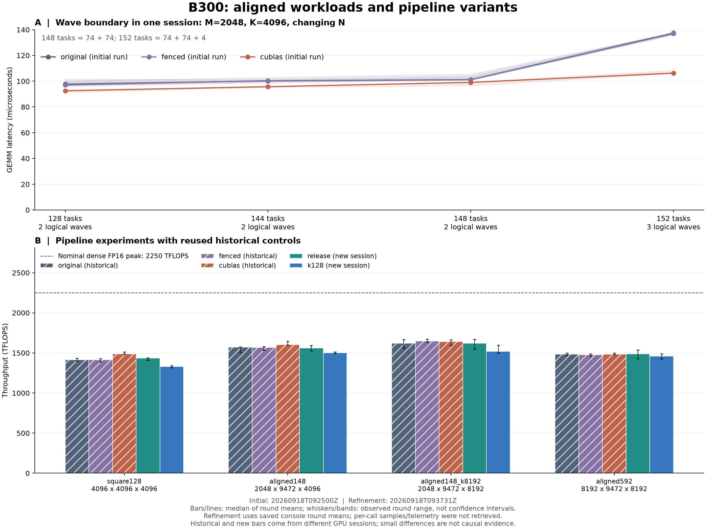

# B300：148 任务对齐与流水线优化实测

**任务数对齐有明确收益；本次流水线改动尚未证明有稳定收益。** 最高记录 wide 相对同形状 fenced 仅高约 0.52%，对应轮间 CV 为 2.80% 与 1.07%，不能把这个微小差距解释为确定的优化效果。

**数据来源说明：初次 54 组测量保留逐次原始样本和 6 份 NCU 报告；新增 8 组由已落盘控制台恢复完整 7 轮均值及三种子验证日志。** 新会话云端工作已完成，但 Modal heartbeat 断线导致返回取消；逐次计时样本、GPU UUID/telemetry、计时后误差详情及两份新增 NCU 报告未取回。计时后验证通过由执行到 `CASE_COMPLETE` 的控制流证据推断，不是恢复了未取得的详细记录。收到不要重复的要求后，未重跑已有 GPU 实验。

全部已完成记录中，自定义 kernel 的最高吞吐来自 **aligned148_k8192 / wide（initial）**：**1,656.41 TFLOPS**、0.19188 ms，达到 2250 TFLOPS 标称稠密 FP16 峰值的 **73.62%**。最高值从所有自定义版本中选择，包含 original 和 fenced。

包含库参考在内的最高记录是 **aligned148_k8192 / wide**：1,656.41 TFLOPS。新增候选中最高记录为 **aligned148_k8192 / release**：1,619.67 TFLOPS。

**新增 release/k128 与原版、fenced、cuBLAS 来自不同 B300 会话。** 按要求复用初次对照，没有重复测量历史版本。后文“历史比值”仅表示已保存时延的比值，不是同卡同批配对因果实验；几个百分点的差异不据此宣称显著改善。同一新会话内 release 与 k128 的比较条件更接近，但二者同时改变不同机制，不能单独归因。

相较初次 4096³ original 的 1,415.25 TFLOPS，上述最高自定义记录吞吐为 1.170×。此比较改变了矩阵形状或版本，表示工作负载吞吐提升，不表示同一 GEMM 的等量工作加速。



图中斜线柱是初次历史对照，实心柱是新会话。误差线和色带表示各轮均值的最小至最大范围，不是置信区间。两次运行均以 CUDA events 的轮均值中位数计算性能，`TFLOPS = 2MNK / (ms × 10^9)`。

## 设备、测量与验证

| 会话 | run | GPU | 实际 SM | GPU UUID | driver | 开始时 SM clock |
| --- | --- | --- | --- | --- | --- | --- |
| initial | 20260918T092500Z | NVIDIA B300 SXM6 AC | 148 | GPU-2a595a6c-b3d6-53ba-8d9e-501a875ecb53 | 580.95.05 | 2032 MHz |
| refinement | 20260918T093731Z | B300（请求；GPU metadata 未取回） | 未取回 | 未取回 | 未取回 | 未取回 |

已保存的开始时钟仅为一次 telemetry 快照，不代表整个测量过程锁频。代码配置使用默认动态频率/功率；逐次清理 256 MiB 缓冲区，清理在 CUDA events 之外；随机打乱版本顺序；不用 CUDA Graph。分配、编译、生成输入和校验均不计入时延，事件区间可能包含 host 提交间隙。

FP16 输入/输出、FP32 累加；FP32 reference 禁用 TF32 并最终舍入为 FP16，逐元素 `atol=0.01, rtol=0.02`。每次初始验证前填 NaN 检查漏写；代码在全部计时之后另检查最终输出。

| 会话 | seeds | 种子验证通过 | 计时后验证通过 | 轮数 | 每轮调用上限 |
| --- | --- | --- | --- | --- | --- |
| initial | [0, 1, 2] | 162/162 | 54/54（明细已保存） | 5 | 150 |
| refinement | [0, 1, 2] | 24/24 | 8/8（CASE_COMPLETE 推断） | 7 | 150 |

round CV 是各轮均值的样本标准差除以均值。它反映本次运行的波动，不包含不同 GPU 会话的系统性偏移，也不代替独立重复实验。峰值分母统一为 2250 TFLOPS；它不是本卡当前时钟下实测的持续算力。规格口径见 [NVIDIA HGX](https://www.nvidia.com/en-us/data-center/hgx/)。

## 正好 148 个逻辑任务

kernel 固定启动 148 个 CTA，每两个 CTA 组成一个 cluster，共 74 个 cluster worker。每个逻辑任务计算一个 `512×256` 输出 tile。**148 指逻辑任务数，不是额外增加 grid CTA 数。**等时任务模型的槽位利用率为 `tasks / (74 × ceil(tasks/74))`，属于调度模型而非硬件计数器。

新会话缺少已取回的 GPU UUID 与 telemetry，无法核对两次物理卡身份、时钟或温度差异；因此不能把微小历史比值变化归因于代码优化。新会话的 round CV 和误差线仅由完整日志中的 7 个轮均值计算，未构造逐次计时样本。

| case | M×N×K | 任务 | 逻辑轮数 | 模型槽位利用率 | original ms | original TFLOPS |
| --- | --- | --- | --- | --- | --- | --- |
| square128 | 4096×4096×4096 | 128 | 2 | 86.49% | 0.09711 | 1,415.25 |
| rect128 | 2048×8192×4096 | 128 | 2 | 86.49% | 0.09768 | 1,407.06 |
| rect144 | 2048×9216×4096 | 144 | 2 | 97.30% | 0.10021 | 1,542.96 |
| aligned148 | 2048×9472×4096 | 148 | 2 | 100.00% | 0.10118 | 1,570.60 |
| tail152 | 2048×9728×4096 | 152 | 3 | 68.47% | 0.13706 | 1,190.79 |
| aligned296 | 4096×9472×4096 | 296 | 4 | 100.00% | 0.20204 | 1,573.11 |
| aligned148_k8192 | 2048×9472×8192 | 148 | 2 | 100.00% | 0.19630 | 1,619.08 |
| aligned148_k16384 | 2048×9472×16384 | 148 | 2 | 100.00% | 0.39129 | 1,624.51 |
| aligned592 | 8192×9472×8192 | 592 | 8 | 100.00% | 0.85594 | 1,485.28 |

148→152 时 M、K 不变，算术工作量增加 **2.70%**，benchmark 时延增加 **35.46%**，吞吐从 1,570.60 降至 1,190.79 TFLOPS。148 个任务为 74+74；152 个任务为 74+74+4。下方 NCU 计数器提供了尾轮效应的独立硬件证据。

矩阵长宽比与缓存复用也会变化。square128→aligned148 不能把全部差异归给尾轮；aligned592 同时增大 M、K 与迭代数，也不能单独判定是哪一个因素带来收益。

## 流水线实现与首次结果

| 版本 | K tile / 输入 stage | 每 consumer 写回 | 与 fenced 的主要差别 | SMEM/CTA |
| --- | --- | --- | --- | --- |
| original | 64 / 4 | 4×64 列 | 原教程版本，缺少补充的 TMEM fence | 225 KiB |
| fenced | 64 / 4 | 4×64 列 | 同步控制组 | 225 KiB |
| wide | 64 / 3 | 2×128 列 | 同时扩大写回与减少输入 stage | 209 KiB |
| full_late | 64 / 2 | 1×256 列 | 整块写回后释放 accumulator | 225 KiB |
| full_early | 64 / 2 | 1×256 列 | 整块 TMEM 读出后提前释放 accumulator | 225 KiB |
| release | 64 / 4 | 4×64 列 | 最后一个 chunk 的 TMEM 读完成即释放 | 225 KiB |
| k128 | 128 / 2 | 4×64 列 | 加倍输入 K tile，输入容量保持不变 | 225 KiB |

所有自定义版本保留两个 MMA consumer、双 CTA cluster、384 threads/CTA 和 512 列 TMEM。原始输出路径已使用 `cp.async.bulk.wait_group.read 0`，等待 TMA 不再读取源共享内存，不能说每个 chunk 都等待显存写入彻底完成。[PTX read-wait 语义](https://docs.nvidia.com/cuda/parallel-thread-execution/index.html#data-movement-and-conversion-instructions-cp-async-bulk-wait-group)

| case | original TFLOPS | fenced TFLOPS | wide TFLOPS | full_late TFLOPS | full_early TFLOPS | cublas TFLOPS |
| --- | --- | --- | --- | --- | --- | --- |
| square128 | 1,415.25 | 1,415.08 | 1,399.57 | 1,070.38 | 1,081.05 | 1,488.27 |
| rect128 | 1,407.06 | 1,415.76 | 1,376.90 | 1,063.98 | 1,063.32 | 1,484.87 |
| rect144 | 1,542.96 | 1,540.20 | 1,505.02 | 1,172.90 | 1,188.22 | 1,615.33 |
| aligned148 | 1,570.60 | 1,568.78 | 1,544.65 | 1,187.98 | 1,200.73 | 1,604.34 |
| tail152 | 1,190.79 | 1,187.35 | 1,144.70 | 882.26 | 891.56 | 1,536.08 |
| aligned296 | 1,573.11 | 1,629.21 | 1,601.16 | 1,302.58 | 1,301.08 | 1,617.38 |
| aligned148_k8192 | 1,619.08 | 1,647.82 | 1,656.41 | 1,299.08 | 1,289.45 | 1,641.83 |
| aligned148_k16384 | 1,624.51 | 1,638.48 | 1,626.22 | 1,338.42 | 1,326.94 | 1,641.24 |
| aligned592 | 1,485.28 | 1,475.59 | 1,479.50 | 1,290.00 | 1,297.75 | 1,482.81 |

full_late/full_early 的同会话吞吐/fenced 比值范围为 **0.743–0.879×**。把输出合并为一次 TMA store 未保证净收益：输出缓冲扩大迫使输入 stage 从 4 降到 2，可能削弱隐藏输入延迟的能力，也可能改变寄存器压力和同步等待。这是对负结果的机制假设；未采集这些 full2stage 版本的 stall 归因，不能断言唯一原因。

## 新增候选：全部四种形状

下列三个比值的分子均是初次 run 保存的同形状对照时延，分母是新候选时延；也等于新候选 TFLOPS 除以历史对照 TFLOPS。大于 1 表示记录数值更高。**历史比值不具有同卡同批因果解释，尤其不把几个百分点的差距称为显著加速。**

### release

| case | ms | TFLOPS | 相对历史 original × | 相对历史 fenced × | 相对历史 cuBLAS × | round CV % | 种子验证 | 计时后 |
| --- | --- | --- | --- | --- | --- | --- | --- | --- |
| square128 | 0.09586 | 1,433.81 | 1.013 | 1.013 | 0.963 | 0.87 | 3/3 | CASE_COMPLETE 推断通过 |
| aligned148 | 0.10187 | 1,559.89 | 0.993 | 0.994 | 0.972 | 1.52 | 3/3 | CASE_COMPLETE 推断通过 |
| aligned148_k8192 | 0.19623 | 1,619.67 | 1.000 | 0.983 | 0.987 | 3.17 | 3/3 | CASE_COMPLETE 推断通过 |
| aligned592 | 0.85482 | 1,487.23 | 1.001 | 1.008 | 1.003 | 2.32 | 3/3 | CASE_COMPLETE 推断通过 |

### k128

| case | ms | TFLOPS | 相对历史 original × | 相对历史 fenced × | 相对历史 cuBLAS × | round CV % | 种子验证 | 计时后 |
| --- | --- | --- | --- | --- | --- | --- | --- | --- |
| square128 | 0.10318 | 1,332.06 | 0.941 | 0.941 | 0.895 | 0.61 | 3/3 | CASE_COMPLETE 推断通过 |
| aligned148 | 0.10588 | 1,500.91 | 0.956 | 0.957 | 0.936 | 0.41 | 3/3 | CASE_COMPLETE 推断通过 |
| aligned148_k8192 | 0.20911 | 1,519.87 | 0.939 | 0.922 | 0.926 | 2.71 | 3/3 | CASE_COMPLETE 推断通过 |
| aligned592 | 0.87187 | 1,458.14 | 0.982 | 0.988 | 0.983 | 1.79 | 3/3 | CASE_COMPLETE 推断通过 |

两种新候选在同一新会话内的比较：

| case | k128/release 吞吐比 | release CV % | k128 CV % |
| --- | --- | --- | --- |
| square128 | 0.929 | 0.87 | 0.61 |
| aligned148 | 0.962 | 1.52 | 0.41 |
| aligned148_k8192 | 0.938 | 3.17 | 2.71 |
| aligned592 | 0.980 | 2.32 | 1.79 |

release 尝试增加最后一段写回与下一块 MMA 的重叠，保留四级输入流水线。k128 把每级 K 从 64 增至 128、深度从 4 降至 2，输入缓冲总容量不变；每次 `gemm_async` 展开 8 条 K16 MMA，总 MMA 算术量未减少，改变的是每级加载/提交次数。更少的控制操作与更粗的等待粒度同时存在，性能方向以实测为准。

## Nsight Compute 机制证据

初次 run 原 summary 的 failed 来自 wide CSV 解析器误判；已由逐份成功退出码、有效报告及原始 CSV 恢复硬件指标，原文件保持不变。详见 [初次 NCU 独立审查](<runs/20260918T092500Z/NCU_ANALYSIS.md>)。

NCU 使用 kernel replay、cache-control=all、clock-control=none，一次目标 launch；计数器采集会改变执行条件，NCU 单次耗时不替代上面的 benchmark 排名。Tensor/elapsed、Tensor/active 是不同周期分母的管线活动指标，**不等于按 2MNK 计算的 2250 TFLOPS 峰值百分比**。[NVIDIA 指标定义](https://docs.nvidia.com/nsight-compute/ProfilingGuide/index.html#metrics-structure)

| 会话 | case/variant | SM active % | Tensor/elapsed % | Tensor/active % | DRAM % | L2 hit % | warp occupancy % |
| --- | --- | --- | --- | --- | --- | --- | --- |
| initial | square128/original | 82.11 | 72.21 | 87.93 | 12.74 | 73.30 | 18.69 |
| initial | rect144/original | 90.92 | 80.37 | 88.40 | 16.19 | 66.94 | 18.72 |
| initial | aligned148/original | 93.80 | 82.90 | 88.38 | 16.82 | 64.59 | 18.69 |
| initial | aligned148/wide | 94.24 | 82.06 | 87.08 | 16.91 | 76.20 | 18.67 |
| initial | tail152/original | 66.80 | 59.16 | 88.56 | 13.07 | 76.20 | 18.71 |
| initial | aligned592/original | 96.12 | 91.90 | 95.61 | 17.96 | 77.56 | 18.74 |

initial NCU：状态 `recovered_success`，本报告读取 6 个成功 profile。

refinement NCU：状态 `not_retrieved`，本报告读取 0 个成功 profile。说明：新增两份 profile 在控制台记录 complete，但远端报告、CSV 和指标值未能取回

**实际可审查的 NCU 数据只有初次保存的六份。** 新增两份仅在日志中显示 complete，对应报告文件和指标值未能取回，不列入下表或证据计数，也不据此给 release/k128 做硬件归因。

148→152 的 NCU SM active 从 **93.80%→66.80%**，Tensor/elapsed 从 **82.90%→59.16%**，而 Tensor/active 为 88.38% 与 88.56%。这支持第三轮少量任务拖长 kernel、更多 SM 提前空闲的解释。

成功 profile 的 DRAM 整体吞吐利用率范围为 12.74–17.96%。这些平均指标不能直接定位 TMA、共享内存或 barrier 的瞬时等待。

`launch__waves_per_multiprocessor` 描述物理 grid CTA waves，不能替代 persistent kernel 内部逻辑任务轮数。低 warp occupancy 也不等于同百分比的 Tensor 算力；异步 MMA 和 warp specialization 的利用率需单独观察。

148 任务的原始报告：

- [initial/original .ncu-rep](<runs/20260918T092500Z/artifacts/ncu/aligned148__original.ncu-rep>)；[原始 CSV](<runs/20260918T092500Z/artifacts/ncu/aligned148__original.csv>)
- [initial/wide .ncu-rep](<runs/20260918T092500Z/artifacts/ncu/aligned148__wide.ncu-rep>)；[原始 CSV](<runs/20260918T092500Z/artifacts/ncu/aligned148__wide.csv>)

## 完整数据与复现来源

[全部已验证测量 CSV](<combined_results.csv>) · [可编辑 SVG 图](<final_comparison.svg>)。

以下列出已保存的原始文件及明确标记的控制台恢复文件；恢复文件不替代遗失的逐次原始数据。本报告生成器只读取文件，不触发 GPU、编译或任何重测。

initial 冻结源代码：[sources](<runs/20260918T092500Z/sources>)。

refinement 冻结源代码：[sources](<refinement/runs/20260918T093731Z/sources>)。

| 会话 | 原始文件 | SHA-256 |
| --- | --- | --- |
| initial | [request.json](<runs/20260918T092500Z/request.json>) | `2d131058b083c2fc565f52534b32971e9b2d8fdf6053c53182208338469e5c2b` |
| initial | [artifacts/results.json](<runs/20260918T092500Z/artifacts/results.json>) | `5efd34dbcbefb9814488a09b45ed731901c5cea8b0b8bb526c684d4ee002277b` |
| initial | [source_manifest.json](<runs/20260918T092500Z/source_manifest.json>) | `bcf885469f30b1abf04f4dd7aea6730f420b675f6b3f4166fe8edbff7974bd5d` |
| initial | [build.json](<runs/20260918T092500Z/build.json>) | `1048f60d744576331340714f2be0c416ddcb265a95b0c432a71341faca889f1b` |
| initial | [gpu.json](<runs/20260918T092500Z/gpu.json>) | `cdea986ddabc05d2132633db9c724007ab707d19c493ca73d0fa17023313229a` |
| initial | [ncu_metrics.json](<runs/20260918T092500Z/ncu_metrics.json>) | `2a9f47a6bf7142bdf6c10a9a9eab2bab5215665f88dc65036c35da4be5b2d651` |
| initial | [artifacts/ncu/ncu_summary.json](<runs/20260918T092500Z/artifacts/ncu/ncu_summary.json>) | `052e91ec44d08192a661408184d1d4fba7cd77eac750917c2fe182c715b3688b` |
| refinement | [request.json](<refinement/runs/20260918T093731Z/request.json>) | `af074678d5ca17b09119fe076c2b787d2b4e3921c455db749bd337627ef0583f` |
| refinement | [artifacts/console_results.json](<refinement/runs/20260918T093731Z/artifacts/console_results.json>) | `0ad082814b7d700bb498f682c2c6c50eb4a03dd4aebe7a43af41e023cd3a58c4` |
| refinement | [source_manifest.json](<refinement/runs/20260918T093731Z/source_manifest.json>) | `5a1186aa263e323615b60d1f34e728df260a12f62d2ef1ea39411acac978a5ff` |

生成命令：

```bash
python combine_report.py --initial runs/20260918T092500Z --refinement refinement/runs/20260918T093731Z
```
