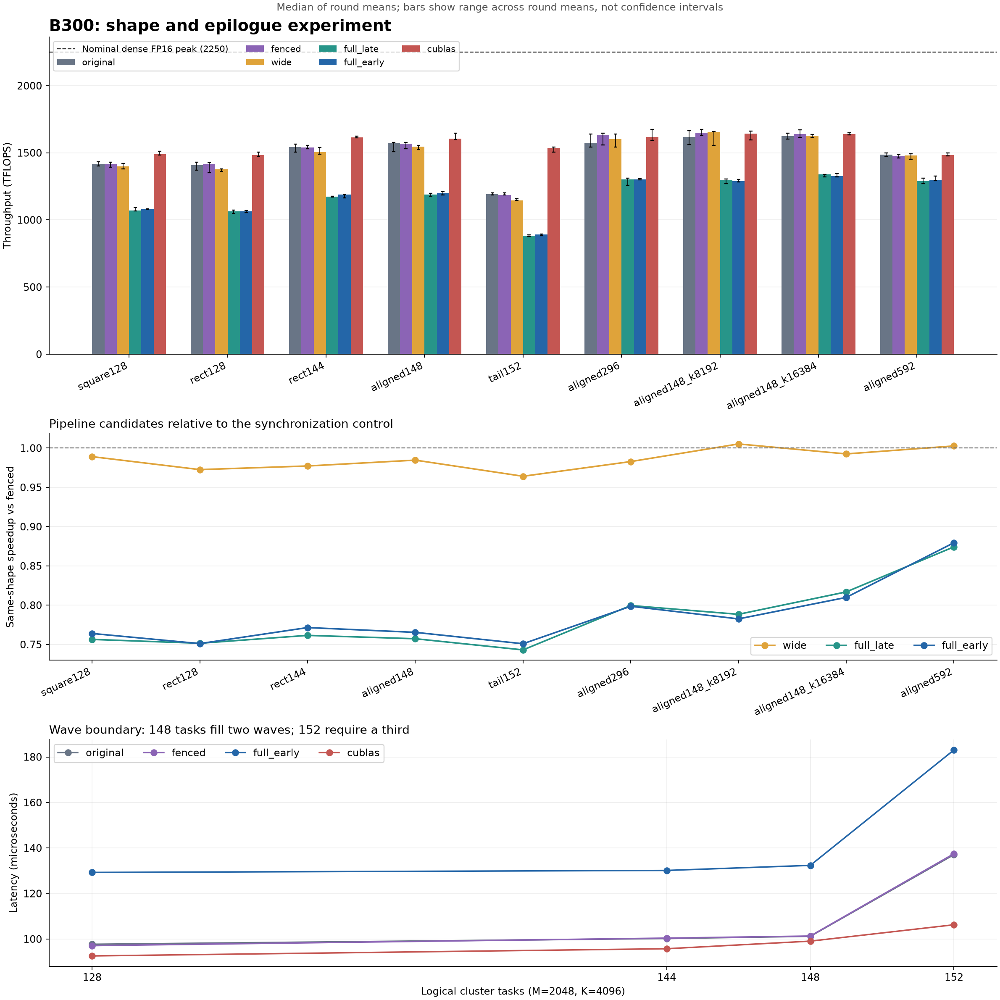

# B300：矩阵形状与 v9 写回流水线对照实验

运行目录：`20260918T092500Z`；测量状态：`complete`。
所有数字均读取本目录的 [原始结果](artifacts/results.json)，未复用此前实验的时延。

完整通过校验的流水线候选中，最高吞吐为 **wide / aligned148_k8192**：0.19188 ms、**1,656.41 TFLOPS**，为 2250 TFLOPS 标称峰值的 **73.62%**。在相同矩阵形状下，它相对 original 为 1.023×、相对 fenced 为 1.005×，达到本次 cuBLAS 吞吐的 100.89%。

该候选相对 fenced 的吞吐优势仅 **0.52%**；两者 round CV 分别为 2.80% 和 1.07%。这点优势处于轮间波动尺度内，**本次未证明确切的流水线收益**。CV 比较用于说明噪声尺度，并非统计显著性检验。

`fenced` 是补充 TMEM 跨线程同步 fence 的控制组，不计入流水线优化候选。最佳候选仅在 `wide`、`full_late`、`full_early` 中按本次时延挑选；这是有限候选的事后比较，不是独立复测确认的最优解。不同矩阵的 TFLOPS 比值表示不同工作负载的吞吐变化，不能当成完成同一任务的加速比。

## 测量口径与校验

设备：`NVIDIA B300 SXM6 AC`；实际 SM 数：148；编译 SM 数：148；架构：`sm_103a`。
计算 `D[M,N] = A[M,K] @ B[N,K].T`，FP16 输入/输出、FP32 累加。cuBLAS 通过 `torch.mm(..., out=...)` 调用，关闭 TF32 与 FP16 reduced-precision reduction。

每形状/版本使用 seeds=[0, 1, 2] 完整矩阵验证；累计种子验证 **162/162 通过**（已记录 162 项），重复计时后的结果验证 **54/54 通过**（已记录 54 项）。参考为 FP32 GEMM 再舍入 FP16，`rtol=0.02, atol=0.01`；单次校验前将输出填 NaN 检查漏写。

CUDA events 测量完整 GEMM，每版本 5 轮，每轮调用上限 150 次，报告轮均值的中位数。每次计时前写入 256 MiB 缓冲区，清理在计时之外；版本顺序逐轮打乱。保持默认动态时钟和功率，不使用 CUDA Graph；事件区间可能包含 host 提交间隙。round CV 是轮均值的样本标准差除以均值，不能据此直接认定微小差距显著。

标称峰值统一采用此前讨论的单卡稠密 FP16 **2250 TFLOPS** 作分母；它不是本卡在测量时钟下的实测峰值。规格口径参考 [NVIDIA HGX](https://www.nvidia.com/en-us/data-center/hgx/)。

## 工作负载与调度模型

五种自定义 kernel 都固定启动 **148 个 CTA**，每两个 CTA 组成一个 cluster，即 **74 个 cluster worker**。一个逻辑任务计算 `512×256` 输出 tile；128、148、152 指逻辑任务总数，grid CTA 数始终不变。假设所有 worker 同时驻留且每个任务等时，模型利用率为 `tasks / (74 × ceil(tasks / 74))`。这是解释尾轮的简化模型，**不是 profiler 测得的 SM/Tensor Core 利用率**。

| case | M×N×K | 逻辑任务 | 模型轮数 | 模型利用率 | GFLOP |
| --- | --- | --- | --- | --- | --- |
| square128 | 4096×4096×4096 | 128 | 2 | 86.49% | 137.44 |
| rect128 | 2048×8192×4096 | 128 | 2 | 86.49% | 137.44 |
| rect144 | 2048×9216×4096 | 144 | 2 | 97.30% | 154.62 |
| aligned148 | 2048×9472×4096 | 148 | 2 | 100.00% | 158.91 |
| tail152 | 2048×9728×4096 | 152 | 3 | 68.47% | 163.21 |
| aligned296 | 4096×9472×4096 | 296 | 4 | 100.00% | 317.83 |
| aligned148_k8192 | 2048×9472×8192 | 148 | 2 | 100.00% | 317.83 |
| aligned148_k16384 | 2048×9472×16384 | 148 | 2 | 100.00% | 635.66 |
| aligned592 | 8192×9472×8192 | 592 | 8 | 100.00% | 1,271.31 |

128 个任务为 74+54，148 个任务为 74+74，152 个任务为 74+74+4。`rect128` 与 `square128` 具有相同 FLOP 和任务数，用于观察长宽比/缓存效应；`rect144`、`aligned148`、`tail152` 固定 M、K，只跨越 N 方向的两轮边界。矩阵形状也会改变 A/B 的缓存复用，因此不能将所有吞吐变化归因于尾轮。

## 实现与控制变量

| 版本 | 输入 stage 数 | 每 consumer 写回 | 累计器复用边界 | 每 CTA SMEM 模型 |
| --- | --- | --- | --- | --- |
| original | 4 | 4×64 列 | 四次 TMA 读取源 SMEM 完成之后 | 225 KiB |
| fenced | 4 | 4×64 列 | 同 original；增加 TMEM before/after fence | 225 KiB |
| wide | 3 | 2×128 列 | 两次 TMA 读取源 SMEM 完成之后 | 209 KiB |
| full_late | 2 | 1×256 列 | 单次 TMA 读取源 SMEM 完成之后 | 225 KiB |
| full_early | 2 | 1×256 列 | TMEM 已全部读出并存入 SMEM 后，TMA store 前 | 225 KiB |

五种自定义 kernel 保留 `512×256×64` 逻辑分块、两个 MMA consumer、384 threads/CTA、512 列 TMEM 分配和 `l2_group_size=8`。SMEM 模型包含 1 KiB 控制区域：输入每 stage 为 `2×128×64×2 + 128×64×2 = 48 KiB`，输出为 `2×128×写回列数×2 bytes`；实际编译资源以保存的 NVCC/PTXAS 记录为准。

`original→fenced` 隔离同步修补的成本；`fenced→wide/full_late` 同时改变写回粒度和输入流水线深度，不能当成只减少 store 次数的单因素实验。**`full_late→full_early` 保持其它结构一致，用于单独测量提前释放累计器、允许下一 tile MMA 与当前 TMA store 重叠的效果。**这不等于双缓冲输出：两者都等待 TMA 读取源共享内存完成后才复用当前 Dsmem。

源码中的 `T.ptx.cp_async.bulk.wait_group(0)` 实际被 TVM lower 为 `cp.async.bulk.wait_group.read 0`。它等待已提交 TMA store 对源共享内存的读取完成，让线程能够安全复用该共享内存，**不表示等待全局内存写入全部完成**。因此不能把 original 的四个 chunk 描述成四次等待显存写入彻底结束。[PTX read-wait 语义](https://docs.nvidia.com/cuda/parallel-thread-execution/index.html#data-movement-and-conversion-instructions-cp-async-bulk-wait-group)

## 各形状结果与最佳流水线候选

| case | original TF | fenced TF | 最佳候选 | 候选 TF | cuBLAS TF | 同形状/original × | 同形状/fenced × | 候选/标称峰值 % |
| --- | --- | --- | --- | --- | --- | --- | --- | --- |
| square128 | 1,415.25 | 1,415.08 | wide | 1,399.57 | 1,488.27 | 0.989 | 0.989 | 62.20 |
| rect128 | 1,407.06 | 1,415.76 | wide | 1,376.90 | 1,484.87 | 0.979 | 0.973 | 61.20 |
| rect144 | 1,542.96 | 1,540.20 | wide | 1,505.02 | 1,615.33 | 0.975 | 0.977 | 66.89 |
| aligned148 | 1,570.60 | 1,568.78 | wide | 1,544.65 | 1,604.34 | 0.983 | 0.985 | 68.65 |
| tail152 | 1,190.79 | 1,187.35 | wide | 1,144.70 | 1,536.08 | 0.961 | 0.964 | 50.88 |
| aligned296 | 1,573.11 | 1,629.21 | wide | 1,601.16 | 1,617.38 | 1.018 | 0.983 | 71.16 |
| aligned148_k8192 | 1,619.08 | 1,647.82 | wide | 1,656.41 | 1,641.83 | 1.023 | 1.005 | 73.62 |
| aligned148_k16384 | 1,624.51 | 1,638.48 | wide | 1,626.22 | 1,641.24 | 1.001 | 0.993 | 72.28 |
| aligned592 | 1,485.28 | 1,475.59 | wide | 1,479.50 | 1,482.81 | 0.996 | 1.003 | 65.76 |

加速比 >1 表示候选更快，<1 表示更慢。表中的 TF 均指 TFLOPS。

## 提前释放累计器的配对消融

| case | full_late ms | full_early ms | late/early × | 时延降低 % | late round CV % | early round CV % |
| --- | --- | --- | --- | --- | --- | --- |
| square128 | 0.12840 | 0.12713 | 1.010 | 0.99 | 0.98 | 0.14 |
| rect128 | 0.12917 | 0.12925 | 0.999 | -0.06 | 0.89 | 0.64 |
| rect144 | 0.13183 | 0.13013 | 1.013 | 1.29 | 0.29 | 0.92 |
| aligned148 | 0.13377 | 0.13235 | 1.011 | 1.06 | 0.59 | 0.81 |
| tail152 | 0.18499 | 0.18306 | 1.011 | 1.04 | 0.55 | 0.49 |
| aligned296 | 0.24400 | 0.24428 | 0.999 | -0.12 | 1.64 | 0.31 |
| aligned148_k8192 | 0.24466 | 0.24648 | 0.993 | -0.75 | 1.13 | 0.70 |
| aligned148_k16384 | 0.47493 | 0.47904 | 0.991 | -0.87 | 0.69 | 0.71 |
| aligned592 | 0.98551 | 0.97963 | 1.006 | 0.60 | 1.12 | 1.04 |

## 148 个任务附近的形状对照

| 版本 | 144 tasks ms | 148 tasks ms | 152 tasks ms | 148/144 吞吐比 | 152/148 吞吐比 |
| --- | --- | --- | --- | --- | --- |
| original | 0.10021 | 0.10118 | 0.13706 | 1.018 | 0.758 |
| fenced | 0.10039 | 0.10130 | 0.13746 | 1.019 | 0.757 |
| wide | 0.10274 | 0.10288 | 0.14258 | 1.026 | 0.741 |
| full_late | 0.13183 | 0.13377 | 0.18499 | 1.013 | 0.743 |
| full_early | 0.13013 | 0.13235 | 0.18306 | 1.011 | 0.743 |
| cublas | 0.09572 | 0.09905 | 0.10625 | 0.993 | 0.957 |

以上三种矩阵的 FLOP 分别随任务数增加；吞吐比不表示相同任务加速。152 比148多约2.70% FLOP，但模型多出第三轮；是否出现明显时延跃升，以此表实测为准。

## 固定148任务时改变 K

| K | 版本 | ms | TFLOPS | 标称峰值 % | round CV % |
| --- | --- | --- | --- | --- | --- |
| 4096 | original | 0.10118 | 1,570.60 | 69.80 | 1.86 |
| 4096 | fenced | 0.10130 | 1,568.78 | 69.72 | 1.17 |
| 4096 | wide | 0.10288 | 1,544.65 | 68.65 | 0.74 |
| 4096 | full_late | 0.13377 | 1,187.98 | 52.80 | 0.59 |
| 4096 | full_early | 0.13235 | 1,200.73 | 53.37 | 0.81 |
| 4096 | cublas | 0.09905 | 1,604.34 | 71.30 | 1.29 |
| 8192 | original | 0.19630 | 1,619.08 | 71.96 | 2.84 |
| 8192 | fenced | 0.19288 | 1,647.82 | 73.24 | 1.07 |
| 8192 | wide | 0.19188 | 1,656.41 | 73.62 | 2.80 |
| 8192 | full_late | 0.24466 | 1,299.08 | 57.74 | 1.13 |
| 8192 | full_early | 0.24648 | 1,289.45 | 57.31 | 0.70 |
| 8192 | cublas | 0.19358 | 1,641.83 | 72.97 | 1.72 |
| 16384 | original | 0.39129 | 1,624.51 | 72.20 | 1.12 |
| 16384 | fenced | 0.38795 | 1,638.48 | 72.82 | 1.35 |
| 16384 | wide | 0.39088 | 1,626.22 | 72.28 | 0.55 |
| 16384 | full_late | 0.47493 | 1,338.42 | 59.49 | 0.69 |
| 16384 | full_early | 0.47904 | 1,326.94 | 58.98 | 0.71 |
| 16384 | cublas | 0.38730 | 1,641.24 | 72.94 | 0.35 |

增加 K 不改变输出 tile 数，但增加 K 循环及 FLOP，可能摊薄初始化和写回开销；也会扩大输入工作集、改变缓存行为。这里比较吞吐，不把更大 K 描述成更快完成同一个 GEMM。

## 性能图

图中误差线是各轮均值对应吞吐的最小—最大范围，不是置信区间；未完成全部校验/测量的条目不绘制。[SVG 矢量图](comparison.svg)

## 全部版本数据

| case | 版本 | ms | TFLOPS | /original × | /fenced × | 峰值 % | cuBLAS % | round CV % | 种子校验 | 计时后校验 | 数据状态 |
| --- | --- | --- | --- | --- | --- | --- | --- | --- | --- | --- | --- |
| square128 | original | 0.09711 | 1,415.25 | 1.000 | 1.000 | 62.90 | 95.09 | 0.88 | 3/3 | 通过 | 完整 |
| square128 | fenced | 0.09712 | 1,415.08 | 1.000 | 1.000 | 62.89 | 95.08 | 1.03 | 3/3 | 通过 | 完整 |
| square128 | wide | 0.09820 | 1,399.57 | 0.989 | 0.989 | 62.20 | 94.04 | 1.05 | 3/3 | 通过 | 完整 |
| square128 | full_late | 0.12840 | 1,070.38 | 0.756 | 0.756 | 47.57 | 71.92 | 0.98 | 3/3 | 通过 | 完整 |
| square128 | full_early | 0.12713 | 1,081.05 | 0.764 | 0.764 | 48.05 | 72.64 | 0.14 | 3/3 | 通过 | 完整 |
| square128 | cublas | 0.09235 | 1,488.27 | 1.052 | 1.052 | 66.15 | 100.00 | 0.77 | 3/3 | 通过 | 完整 |
| rect128 | original | 0.09768 | 1,407.06 | 1.000 | 0.994 | 62.54 | 94.76 | 1.69 | 3/3 | 通过 | 完整 |
| rect128 | fenced | 0.09708 | 1,415.76 | 1.006 | 1.000 | 62.92 | 95.35 | 2.23 | 3/3 | 通过 | 完整 |
| rect128 | wide | 0.09982 | 1,376.90 | 0.979 | 0.973 | 61.20 | 92.73 | 0.57 | 3/3 | 通过 | 完整 |
| rect128 | full_late | 0.12917 | 1,063.98 | 0.756 | 0.752 | 47.29 | 71.65 | 0.89 | 3/3 | 通过 | 完整 |
| rect128 | full_early | 0.12925 | 1,063.32 | 0.756 | 0.751 | 47.26 | 71.61 | 0.64 | 3/3 | 通过 | 完整 |
| rect128 | cublas | 0.09256 | 1,484.87 | 1.055 | 1.049 | 65.99 | 100.00 | 0.86 | 3/3 | 通过 | 完整 |
| rect144 | original | 0.10021 | 1,542.96 | 1.000 | 1.002 | 68.58 | 95.52 | 1.58 | 3/3 | 通过 | 完整 |
| rect144 | fenced | 0.10039 | 1,540.20 | 0.998 | 1.000 | 68.45 | 95.35 | 0.58 | 3/3 | 通过 | 完整 |
| rect144 | wide | 0.10274 | 1,505.02 | 0.975 | 0.977 | 66.89 | 93.17 | 1.41 | 3/3 | 通过 | 完整 |
| rect144 | full_late | 0.13183 | 1,172.90 | 0.760 | 0.762 | 52.13 | 72.61 | 0.29 | 3/3 | 通过 | 完整 |
| rect144 | full_early | 0.13013 | 1,188.22 | 0.770 | 0.771 | 52.81 | 73.56 | 0.92 | 3/3 | 通过 | 完整 |
| rect144 | cublas | 0.09572 | 1,615.33 | 1.047 | 1.049 | 71.79 | 100.00 | 0.37 | 3/3 | 通过 | 完整 |
| aligned148 | original | 0.10118 | 1,570.60 | 1.000 | 1.001 | 69.80 | 97.90 | 1.86 | 3/3 | 通过 | 完整 |
| aligned148 | fenced | 0.10130 | 1,568.78 | 0.999 | 1.000 | 69.72 | 97.78 | 1.17 | 3/3 | 通过 | 完整 |
| aligned148 | wide | 0.10288 | 1,544.65 | 0.983 | 0.985 | 68.65 | 96.28 | 0.74 | 3/3 | 通过 | 完整 |
| aligned148 | full_late | 0.13377 | 1,187.98 | 0.756 | 0.757 | 52.80 | 74.05 | 0.59 | 3/3 | 通过 | 完整 |
| aligned148 | full_early | 0.13235 | 1,200.73 | 0.765 | 0.765 | 53.37 | 74.84 | 0.81 | 3/3 | 通过 | 完整 |
| aligned148 | cublas | 0.09905 | 1,604.34 | 1.021 | 1.023 | 71.30 | 100.00 | 1.29 | 3/3 | 通过 | 完整 |
| tail152 | original | 0.13706 | 1,190.79 | 1.000 | 1.003 | 52.92 | 77.52 | 0.47 | 3/3 | 通过 | 完整 |
| tail152 | fenced | 0.13746 | 1,187.35 | 0.997 | 1.000 | 52.77 | 77.30 | 0.55 | 3/3 | 通过 | 完整 |
| tail152 | wide | 0.14258 | 1,144.70 | 0.961 | 0.964 | 50.88 | 74.52 | 0.47 | 3/3 | 通过 | 完整 |
| tail152 | full_late | 0.18499 | 882.26 | 0.741 | 0.743 | 39.21 | 57.44 | 0.55 | 3/3 | 通过 | 完整 |
| tail152 | full_early | 0.18306 | 891.56 | 0.749 | 0.751 | 39.62 | 58.04 | 0.49 | 3/3 | 通过 | 完整 |
| tail152 | cublas | 0.10625 | 1,536.08 | 1.290 | 1.294 | 68.27 | 100.00 | 1.06 | 3/3 | 通过 | 完整 |
| aligned296 | original | 0.20204 | 1,573.11 | 1.000 | 0.966 | 69.92 | 97.26 | 2.55 | 3/3 | 通过 | 完整 |
| aligned296 | fenced | 0.19508 | 1,629.21 | 1.036 | 1.000 | 72.41 | 100.73 | 2.30 | 3/3 | 通过 | 完整 |
| aligned296 | wide | 0.19850 | 1,601.16 | 1.018 | 0.983 | 71.16 | 99.00 | 2.50 | 3/3 | 通过 | 完整 |
| aligned296 | full_late | 0.24400 | 1,302.58 | 0.828 | 0.800 | 57.89 | 80.54 | 1.64 | 3/3 | 通过 | 完整 |
| aligned296 | full_early | 0.24428 | 1,301.08 | 0.827 | 0.799 | 57.83 | 80.44 | 0.31 | 3/3 | 通过 | 完整 |
| aligned296 | cublas | 0.19651 | 1,617.38 | 1.028 | 0.993 | 71.88 | 100.00 | 2.11 | 3/3 | 通过 | 完整 |
| aligned148_k8192 | original | 0.19630 | 1,619.08 | 1.000 | 0.983 | 71.96 | 98.61 | 2.84 | 3/3 | 通过 | 完整 |
| aligned148_k8192 | fenced | 0.19288 | 1,647.82 | 1.018 | 1.000 | 73.24 | 100.36 | 1.07 | 3/3 | 通过 | 完整 |
| aligned148_k8192 | wide | 0.19188 | 1,656.41 | 1.023 | 1.005 | 73.62 | 100.89 | 2.80 | 3/3 | 通过 | 完整 |
| aligned148_k8192 | full_late | 0.24466 | 1,299.08 | 0.802 | 0.788 | 57.74 | 79.12 | 1.13 | 3/3 | 通过 | 完整 |
| aligned148_k8192 | full_early | 0.24648 | 1,289.45 | 0.796 | 0.783 | 57.31 | 78.54 | 0.70 | 3/3 | 通过 | 完整 |
| aligned148_k8192 | cublas | 0.19358 | 1,641.83 | 1.014 | 0.996 | 72.97 | 100.00 | 1.72 | 3/3 | 通过 | 完整 |
| aligned148_k16384 | original | 0.39129 | 1,624.51 | 1.000 | 0.991 | 72.20 | 98.98 | 1.12 | 3/3 | 通过 | 完整 |
| aligned148_k16384 | fenced | 0.38795 | 1,638.48 | 1.009 | 1.000 | 72.82 | 99.83 | 1.35 | 3/3 | 通过 | 完整 |
| aligned148_k16384 | wide | 0.39088 | 1,626.22 | 1.001 | 0.993 | 72.28 | 99.08 | 0.55 | 3/3 | 通过 | 完整 |
| aligned148_k16384 | full_late | 0.47493 | 1,338.42 | 0.824 | 0.817 | 59.49 | 81.55 | 0.69 | 3/3 | 通过 | 完整 |
| aligned148_k16384 | full_early | 0.47904 | 1,326.94 | 0.817 | 0.810 | 58.98 | 80.85 | 0.71 | 3/3 | 通过 | 完整 |
| aligned148_k16384 | cublas | 0.38730 | 1,641.24 | 1.010 | 1.002 | 72.94 | 100.00 | 0.35 | 3/3 | 通过 | 完整 |
| aligned592 | original | 0.85594 | 1,485.28 | 1.000 | 1.007 | 66.01 | 100.17 | 0.54 | 3/3 | 通过 | 完整 |
| aligned592 | fenced | 0.86156 | 1,475.59 | 0.993 | 1.000 | 65.58 | 99.51 | 0.69 | 3/3 | 通过 | 完整 |
| aligned592 | wide | 0.85928 | 1,479.50 | 0.996 | 1.003 | 65.76 | 99.78 | 1.07 | 3/3 | 通过 | 完整 |
| aligned592 | full_late | 0.98551 | 1,290.00 | 0.869 | 0.874 | 57.33 | 87.00 | 1.12 | 3/3 | 通过 | 完整 |
| aligned592 | full_early | 0.97963 | 1,297.75 | 0.874 | 0.879 | 57.68 | 87.52 | 1.04 | 3/3 | 通过 | 完整 |
| aligned592 | cublas | 0.85736 | 1,482.81 | 0.998 | 1.005 | 65.90 | 100.00 | 0.56 | 3/3 | 通过 | 完整 |

[完整 CSV](measurements.csv) 保存所有版本、模型值、轮数和验证状态；[原始 JSON](artifacts/results.json) 保存逐次事件时间、每轮均值、运行顺序和遥测。

## 来源与运行记录

- [请求参数](request.json)、[源码 SHA256](source_manifest.json)
- [原始 v9 源码快照](sources/kernels_advanced.py)、[候选源码快照](sources/kernels_tuned.py)
- [计时代码快照](sources/benchmark.py)、[编译记录](build.json)、[GPU 日志](gpu.json)
- [MLC advanced GEMM](https://mlc.ai/modern-gpu-programming-for-mlsys/zh/chapter_gemm_advanced/index.html)
- [MLC async GEMM](https://mlc.ai/modern-gpu-programming-for-mlsys/zh/chapter_gemm_async/index.html)
- [NVIDIA wave quantization 说明](https://docs.nvidia.com/deeplearning/performance/dl-performance-matrix-multiplication/index.html#wave-quantization)

**Nsight Compute 的 6 组硬件 profile 与 CSV 导出实际全部成功。**原始 `ncu_summary.json` 中的 `failed` 是 CSV 解析器误报：解析器期待 long CSV，却收到 `--page raw` 的 wide CSV。原始 summary 和采集文件保持不变；已从原始 CSV 独立恢复指标，见 [NCU 分析](NCU_ANALYSIS.md) 与 [恢复后的指标和来源校验值](ncu_metrics.json)。Profiler 回放计时与正式 benchmark 分开，不能替代重复计时排名。

Profiler 原始附件如下；逐项指标解释参见上面的独立分析（如存在）。调度模型利用率不替代 profiler 指标。

- [artifacts/ncu/aligned148__original.ncu-rep](artifacts/ncu/aligned148__original.ncu-rep)
- [artifacts/ncu/aligned148__original.profile.log](artifacts/ncu/aligned148__original.profile.log)
- [artifacts/ncu/aligned148__wide.ncu-rep](artifacts/ncu/aligned148__wide.ncu-rep)
- [artifacts/ncu/aligned148__wide.profile.log](artifacts/ncu/aligned148__wide.profile.log)
- [artifacts/ncu/aligned592__original.ncu-rep](artifacts/ncu/aligned592__original.ncu-rep)
- [artifacts/ncu/aligned592__original.profile.log](artifacts/ncu/aligned592__original.profile.log)
- [artifacts/ncu/ncu_summary.json](artifacts/ncu/ncu_summary.json)
- [artifacts/ncu/rect144__original.ncu-rep](artifacts/ncu/rect144__original.ncu-rep)
- [artifacts/ncu/rect144__original.profile.log](artifacts/ncu/rect144__original.profile.log)
- [artifacts/ncu/square128__original.ncu-rep](artifacts/ncu/square128__original.ncu-rep)
- [artifacts/ncu/square128__original.profile.log](artifacts/ncu/square128__original.profile.log)
- [artifacts/ncu/tail152__original.ncu-rep](artifacts/ncu/tail152__original.ncu-rep)
- [artifacts/ncu/tail152__original.profile.log](artifacts/ncu/tail152__original.profile.log)
